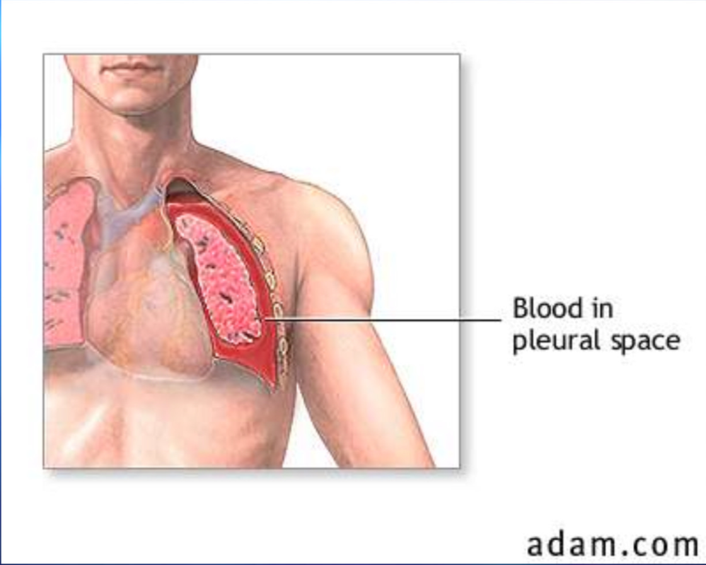
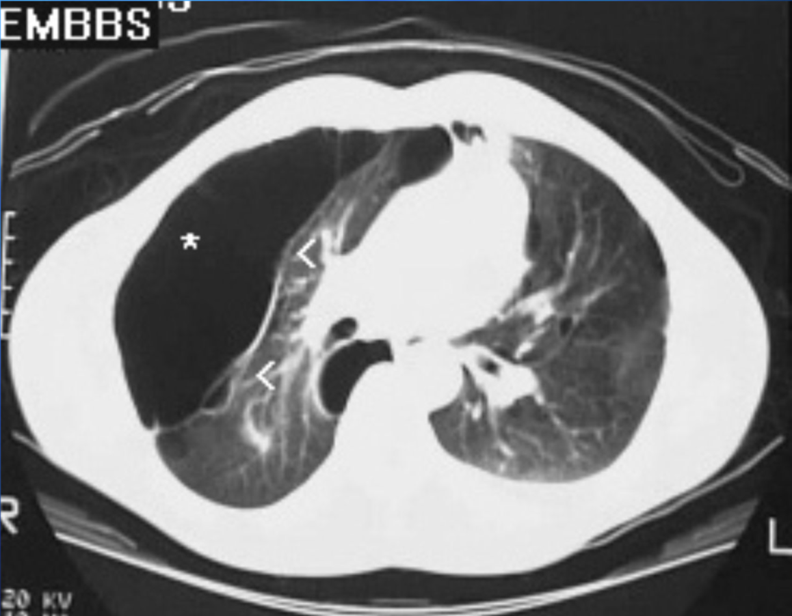
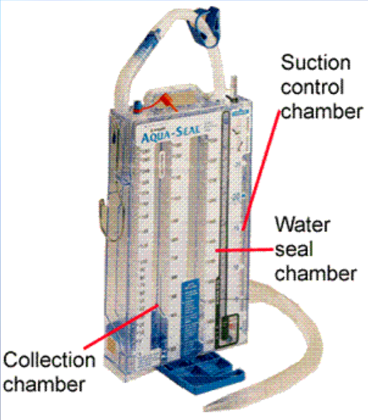

# Introduction

A pneumothorax is defined as a collection of air outside the lung but within the pleural cavity. It occurs when air accumulates between the parietal and visceral pleurae inside the chest. The air accumulation can apply pressure on the lung and make it collapse. The degree of collapse determines the clinical presentation of pneumothorax. Air can enter the pleural space by two mechanisms, either by trauma causing a communication through the chest wall or from the lung by rupture of visceral pleura. There are two types of pneumothorax: traumatic and atraumatic. The two subtypes of atraumatic pneumothorax are primary and secondary. A primary spontaneous pneumothorax (PSP) occurs automatically without a known eliciting event, while a secondary spontaneous pneumothorax (SSP) occurs subsequent to an underlying pulmonary disease. A traumatic pneumothorax can be the result of blunt or penetrating trauma. Pneumothoraces can be even further classified as simple, tension, or open. A simple pneumothorax does not shift the mediastinal structures, as does a tension pneumothorax. Open pneumothorax is an open wound in the chest wall through which air moves in and out.[1][2][3][4]

# Etiology
Risk factors for primary spontaneous pneumothorax

- [ ] Smoking
- [ ] Tall thin body habitus in an otherwise healthy person
- [ ] Pregnancy
- [ ] Marfan syndrome
- [ ] Familial pneumothorax

Diseases associated with secondary spontaneous  pneumothorax

- [ ] COPD
- [ ] Asthma
- [ ] HIV with pneumocystis pneumonia
- [ ] Necrotizing pneumonia
- [ ] Tuberculosis
- [ ] Sarcoidosis
- [ ] Cystic fibrosis
- [ ] Bronchogenic carcinoma
- [ ] Idiopathic pulmonary fibrosis
- [ ] Severe ARDS
- [ ] Langerhans cell histiocytosis
- [ ] Lymphangioleiomyomatosis
- [ ] Collagen vascular disease
- [ ] Inhalational drug use like cocaine or marijuana
- [ ] Thoracic endometriosis

Causes of iatrogenic pneumothorax
- [ ] Pleural biopsy
- [ ] Transbronchial lung biopsy
- [ ] Transthoracic pulmonary nodule biopsy
- [ ] Central venous catheter insertion
- [ ] Tracheostomy
- [ ] Intercostal nerve block
- [ ] Positive pressure ventilation

Causes of traumatic pneumothorax

- [ ] Penetrating or blunt trauma
- [ ] Rib fracture
- [ ] Diving or flying

Causes of tension pneumothorax

- [ ] Penetrating or blunt trauma
- [ ] Barotrauma due to positive pressure ventilation
- [ ] Percutaneous tracheostomy
- [ ] Conversion of spontaneous pneumothorax to tension
- [ ] Open pneumothorax when occlusive dressing work as one way valve

Causes of pneumomediastinum

- [ ] Asthma
- [ ] Parturition
- [ ] Emesis
- [ ] Severe cough
- [ ] Traumatic disruption of oropharyngeal or esophageal mucosa

# Epidemiology
Primary spontaneous pneumothorax mostly occurs in 20-30 years of age. The incidence of PSP in the United States is 7 per 100,000 men and 1 per 100,000 women per year[5]. The majority of recurrence occurs within the first year, and incidence ranges widely from 25% to 50%. The recurrence rate is highest over the first 30 days.

Secondary spontaneous pneumothorax is more seen in old age patients 60-65 years. The incidence of SSP is 6.3 and 2 cases for men and women per 100,000 patients, respectively. The male to female ratio is 3:1. COPD has an incidence of 26 pneumothoraces per 100,000 patients.[6] The risk of spontaneous pneumothorax in heavy smokers is 102 times higher than non-smokers.

The leading cause of iatrogenic pneumothorax is transthoracic needle aspiration (usually for biopsies), and the second leading cause is central venous catheterization. These occur more frequently than spontaneous pneumothorax, and their number is increasing as intensive care modalities are advancing. The incidence of iatrogenic pneumothorax is 5 per 10,000 admissions in the hospital.

The incidence of tension pneumothorax is difficult to determine as one-third of cases in trauma centers have decompressive needle thoracostomies before reaching the hospital, and not all of these had tension pneumothorax.

Pneumomediastinum has an incidence of 1 case per 10,000 admissions in the hospital.

# Pathophysiology
The pressure gradient inside the thorax changes with a pneumothorax. Normally the pressure of the pleural space is negative when compared to atmospheric pressure. When the chest wall expands outwards, the lung also expands outwards due to surface tension between parietal and visceral pleurae. Lungs have a tendency to collapse due to elastic recoil. When there is communication between the alveoli and the pleural space, air fills this space changing the gradient, lung collapse unit equilibrium is achieved, or the rupture is sealed. Pneumothorax enlarges, and lung gets smaller due to this vital capacity, and oxygen partial pressure decreases. Clinical presentation of a pneumothorax can range anywhere from asymptomatic to chest pain and shortness of breath. A tension pneumothorax can cause severe hypotension (obstructive shock) and even death. Beck's triad describes symptoms commonly associated with tension pneumothorax. The three components of Beck's triad are distended neck veins, distant heart sounds, and hypotension. Other symptoms include tachypnea, dyspnea, tachycardia, and hypoxia.

Spontaneous pneumothorax in the majority of patients occurs due to the rupture of bullae or blebs. Primary spontaneous pneumothorax is defined as occurring in patients without underlying lung disease but these patients had asymptomatic bullae or blebs on thoracotomy. Primary spontaneous pneumothorax occurs in tall and thin young people due to increased shear forces or more negative pressure at the apex of the lung. Lung inflammation and oxidative stress are essential to the pathogenesis of primary spontaneous pneumothorax. Current smokers have increased inflammatory cells in small airways and are at increased risk of pneumothorax.

Secondary spontaneous pneumothorax occurs in the presence of underlying lung disease, primarily chronic obstructive pulmonary disease; others may include tuberculosis, sarcoidosis, cystic fibrosis, malignancy, idiopathic pulmonary fibrosis, and pneumocystis jiroveci pneumonia.

Iatrogenic pneumothorax occurs due to a complication of a medical or surgical procedure. Thoracentesis is the most common cause.

Traumatic pneumothoraces can result from blunt or penetrating trauma, these often create a one-way valve in the pleural space (letting the airflow in but not to flow out) and hence hemodynamic compromise. Tension pneumothorax most commonly occurs in ICU settings, in positive pressure ventilated patients.

# History and Physical
In primary spontaneous pneumothorax, the patient is minimally symptomatic as otherwise healthy individuals tolerate physiologic consequences well. The most common symptoms are chest pain and shortness of breath. The chest pain is pleuritic, sharp, severe, and radiates to the ipsilateral shoulder. In SSP, dyspnea is more severe because of decreased underlying lung reserve.

The history of pneumothorax in the past is important as recurrence is seen in 15-40% cases. Recurrence on the contralateral side can also occur.

On examination, the following findings are noted

- [ ] Respiratory discomfort
- [ ] Increased respiratory rate
- [ ] Asymmetrical lung expansion
- [ ] Decreased tactile fremitus
- [ ] Hyperresonant percussion note
- [ ] Decreased intensity of breath sounds or absent breath sounds

In tension pneumothorax following additional findings are seen
- [ ] Tachycardia more than 134 beats per minute
- [ ] Hypotension
- [ ] Jugular venous distension
- [ ] Cyanosis
- [ ] Respiratory failure
- [ ] Cardiac arrest

Some traumatic pneumothoraces are associated with subcutaneous emphysema. Pneumothorax may be difficult to diagnose from a physical exam, especially in a noisy trauma bay. However, it is essential to make the diagnosis of tension pneumothorax on a physical exam.

# Evaluation
Chest radiography, ultrasonography, or CT can be used for diagnosis, although diagnosis from a chest x-ray is more common. Radiographic findings of 2.5 cm air space are equivalent to a 30% pneumothorax. Occult pneumothoraces may be diagnosed by CT but are usually clinically insignificant.
### Chest Xray: Tension Pneumothorax

### Pneumothorax: CT scan (right sided)

The extended focused abdominal sonography for trauma (E-FAST) exam has been a more recent diagnostic tool for pneumothorax. The diagnosis of ultrasound is usually made by the absence of lung sliding, the absence of a comet-tails artifact, and the presence of a lung point. Unfortunately, this diagnostic method is very operator dependent and sensitivity, and specificity can vary. In skilled hands, ultrasonography has up to a 94% sensitivity and 100% specificity (better than chest x-ray). If a patient is hemodynamically unstable with suspected tension pneumothorax, intervention is not withheld to await imaging. Needle decompression can be performed if the patient is hemodynamically unstable with a convincing history and physical exam, indicating tension pneumothorax.

# Treatment / Management
Management depends on the clinical scenario.

For patients who have associated symptoms and are showing signs of instability, needle decompression is the treatment of a pneumothorax. This usually is performed with a 14- to 16-gauge and 4.5 cm in length angiocatheter, just superior to the rib in the second intercostal space in the midclavicular line. After needle decompression or for stable pneumothoraces, the treatment is the insertion of a thoracostomy tube. This usually is placed above the rib in the fifth intercostal space anterior to the midaxillary line. The size of the thoracostomy tube usually ranges depending on the patient's height and weight and whether there is an associated hemothorax.

Open "sucking" chest wounds are treated initially with a three-sided occlusive dressing. Further treatment may require tube thoracostomy and/or chest wall defect repair.

An asymptomatic small primary spontaneous pneumothorax (depth less than 2cm) patient is usually discharged with follow up in outpatient after 2-4 weeks. If the patient is symptomatic or depth/size is more than 2cm needle aspiration is done, after aspiration, if the patient improves and residual depth is less than 2cm then the patient is discharged otherwise tube thoracostomy is done.

In secondary spontaneous pneumothorax, if size/depth of pneumothorax is less than 1cm and no dyspnea then the patient is admitted, high flow oxygen is given and observation is done for 24 hours. If size/ depth is between 1-2cm, needle aspiration is done, then the residual size of pneumothorax is seen, if the depth after the needle aspiration is less than 1cm management is done with oxygen inhalation and observation and in case of more than 2cm, tube thoracostomy is done. In case of depth more than 2cm or breathlessness, tube thoracostomy is done.

Air can reabsorb from the pleural space at a rate of 1.5%/day. Using supplemental oxygen can increase this reabsorption rate. By increasing the fraction of inspired oxygen concentration, the nitrogen of atmospheric air is displaced changing the pressure gradient between the air in the pleural space and the capillaries. Pneumothorax on chest radiography approximately 25% or larger usually needs treatment with needle aspiration if symptomatic and if it fails then tube thoracostomy is done.

**Indications for surgical intervention(VATS vs. thoracotomy)**

- [ ] Continuous air leak for longer than seven days
- [ ] Bilateral pneumothoraces
- [ ] The first episode in high-risk profession patient, i.e., Divers, pilots
- [ ] Recurrent ipsilateral pneumothorax
- [ ] Contralateral pneumothorax
- [ ] Patients who have AIDS

Patients who undergo a video-assisted thoracic surgery (VATS) get pleurodesis to occlude pleural space. Mechanical pleurodesis with bleb/bullectomy decreases the recurrence rate of pneumothorax to <5%. Options for mechanical pleurodesis include stripping of the parietal pleura versus using an abrasive "scratchpad" or dry gauze. A chemical pleurodesis is an option in patients who may not tolerate mechanical pleurodesis. Options for chemical pleurodesis include talc, tetracycline, doxycycline, or minocycline, which are all irritants to the pleural lining.

# Differential Diagnosis
Differential diagnoses of pneumothorax include:

- [ ] Aspiration, bacterial or viral pneumonia
- [ ] Acute aortic dissection
- [ ] Myocardial infarction
- [ ] Pulmonary embolism
- [ ] Acute pericarditis
- [ ] Esophageal spasm
- [ ] Esophageal rupture
- [ ] Rib fracture
- [ ] Diaphragmatic injuries

# Prognosis

PSP is usually benign and mostly resolves on its own without any major intervention. Recurrence can occur up to three years period. Recurrence rate in the following five years is 30% for PSP and 43% for SSP. The risk of recurrence increases with each subsequent pneumothorax; it is 30% with first, 40% after a send, and more than 50% after the third recurrence. PSP is not considered a major health threat, but deaths have been reported. SSPs are more lethal depending upon underlying lung disease and the size of the pneumothorax. Patients with COPD and HIV have high mortality after pneumothorax. The mortality of SSP is 10%. Mortality of tension pneumothorax is high if appropriate measures are not taken.

# Complications
- [ ] Respiratory failure or arrest
- [ ] Cardiac arrest
- [ ] Pyopneumothorax
- [ ] Empyema
- [ ] Rexpansion pulmonary edema
- [ ] Pneumopericardium
- [ ] Pneumoperitoneum
- [ ] Pneumohemothorax
- [ ] Bronchopulmonary fistula
- [ ] Damage to the neurovascular bundle during tube thoracostomy
- [ ] Pain and skin infection at the site of tube thoracostomy

# Consultations

- [ ] Interventional radiologist
- [ ] Thoracic surgeon
- [ ] Pulmonology consultant

# Deterrence and Patient Education
Patients with pneumothorax should be educated that they should not travel by air or to remote areas until after the complete resolution of pneumothorax. Patients with high-risk occupations like scuba divers and pilots should be advised that they should not dive or fly until definitive surgical management of their pneumothorax is done.

All patients are advised to stop smoking. They should be assessed for their will to quit smoking; they should be educated and provided pharmacotherapy if they decided to quit.

# Pearls and Other Issues

Do not let a chest radiograph or CT scan delay treatment with needle decompression or thoracostomy tube if the patient is clinically unstable, i.e., tension pneumothorax.

Worsening subcutaneous emphysema can be associated with malposition of a chest tube and repositioning with a new chest tube is recommended. A chest tube should never be reinserted as this can increase the patient's risk for empyema.

An untreated pneumothorax is a contraindication for flying or scuba diving. If air transport is required, then a thoracostomy tube should be placed before transport.

If there is a persistent or recurrent pneumothorax despite treatment with thoracostomy tube, these patients need specialty consultations for a possible video-assisted thoracoscopic surgery (VATS) with or without pleurodesis or thoracotomy.

If the patient is discharged from the hospital after a resolved pneumothorax, recommendations should be made for no flying or scuba diving for a minimum of two weeks. Patients with a known history of spontaneous pneumothorax should not be medically cleared for occupations involving flying or scuba diving.

# Enhancing Healthcare Team Outcomes
The management of a pneumothorax is often done by the emergency department physician. In some cases, the disorder may be managed by the ICU staff and the thoracic surgeon. The care of patients who have a chest tube is done by the nurse. All nurses who manage patients with a chest tube should know how a chest drain functions. Patients need to be examined every shift and the patency of the chest tube is important. Patients with small pneumothorax can be observed if they have no symptoms. If discharged the patient should be seen within 24 hours.
### Chest Drainage

### ITCT disposable system

