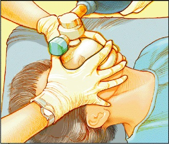
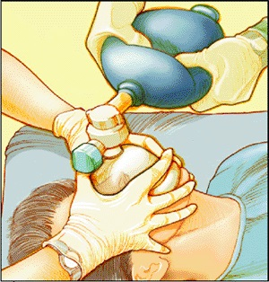

# Bag-valve–mask ventilation
You can use a bag-valve–mask device to manually ventilate a patient whose respirations are absent or inadequate. Ideally,two rescuers should work together on an adult.

## DO
* Lower the head of the bed, remove any pillows, and place the patient supine.
* Assess his level of consciousness, open his airway, and assess his breathing and circulation.
* If he needs emergency ventilation, get a bag-valve–mask device and make sure the mask is securely attached to the bag. Put on gloves.
* Connect tubing from an oxygen source to the oxygen port on the device and adjust oxygen flow to 10 to 15 liters/minute.

### First rescuer

Stand at the top of the patient's head. Place the apex of the mask over the bridge of his nose with the base of the mask between his lower lip and chin to ensure a tight seal.

Place the thumb and index finger of each hand along the mask's lateral edges to provide a complete seal. With the remaining fingers of both hands, lift the patient's mandible and extend his neck to open his airway.

### Second rescuer

Using both hands, slowly, gently, and completely squeeze the bag for 2 seconds until you see the patient's chest rise. Then let the bag reinflate, and you should see his chest fall.

Provide ventilation every 5 seconds and watch the rise and fall of his chest. If it doesn't rise each time you squeeze the bag, ask the other rescuer to make sure the patient's airway is properly opened and the seal between the mask and his face is leakproof, then resume bag compressions.

## DON'T
* Don't use the head-tilt/chin-lift method to open the patient's airway if you suspect head or neck trauma.
* Don't remove his dentures unless they interfere with ventilations.
* Don't use larger tidal volumes than you need to cause his chest to rise and fall. This can result in gastric distension, regurgitation, aspiration, and pneumonia.

# Non-Invasive Positive Pressure Ventilation

Method of ventilation without an endotracheal tube or tracheostomy: tight-fitting nasal, oro-nasal or face mask attached to a non-invasive positive pressure ventilator (NPPV or CPAP/BIPAP) unit.

The NPPV unit can be programmed to deliver:

* Respiratory rate
* Inspiratory positive airway pressure(IPAP)
* Expiratory pressure (EPAP)
* Supplemental FiO2 (I deleted this last bit because this is not always the set criteria...some patients can have permissive hypoxemia etc)

# Continuous Positive Airway Pressure (CPAP)
Provides continuous positive pressure to keep alveoli open and enhance ventilation and oxygenation
* Decreases work of breathing (WOB)
* Increases Oxygenation by enhancing ventilation and facilitating oxygen delivery
* Potential complication: Positive pressure increases intrathoracic pressure which can decrease cardiac preload (blood return to the heart) and thus cardiac output (blood pumped out of the heart)

# Bilevel Positive Airway Pressure (BiPAP)
Provides two levels of continuous positive pressure: one amount of pressure during exhalation (to keep alveoli open) and one (higher) amount of pressure during inhalation (to keep alveoli open and to further decrease WOB)
* Decreases work of breathing (WOB)- can provide more support than CPAP
* Increases Oxygenation by enhancing ventilation and facilitating oxygen delivery
* Potential complication: Positive pressure increases intrathoracic pressure which can decrease cardiac preload (blood return to the heart) and thus cardiac output (blood pumped out of the heart)

BiPAP Machine

BiPAP Masks

# Nursing Considerations

* Indications:
To avoid intubation in a patient with respiratory distress
To avoid reintubation in a patient who has been extubated
To provide ventilatory support in a patient who is "DNI" (do not intubate)

* Contraindications:
Somnolence
Claustrophobia
High aspiration risk
Inability to clear secretions
Recent facial or gastroesophageal surgery
Craniofacial trauma
Burns

* Nursing Care
Aerosolized Intervention: Use N95 mask when caring for patients using either BiPAP or CPAP.
Collaborate with respiratory therapy to ensure mask fits appropriately and there are no air leaks
Monitor patient's tidal volume, ABG, RR
Monitor for signs of respiratory decompensation

Monitor for potential complications:
* signs of low preload and low cardiac output
* skin integrity issues around face and drying of mucous membranes
* patient comfort due to nature of mask
* aspiration
* respiratory drive
* malnutrition or dehydration (due to possible reduced oral intake)

# Question 1
What type of mask should be used when caring for patients who use BiPAP or CPAP machines?

[RIGHT] N95 respirator mask
[WRONG] Standard surgical mask
[WRONG] Full face mask

# Question 2
An artificial airway, like an endotracheal tube, is used in the following type of ventilation

[RIGHT] Positive Pressure
[WRONG] Negative pressure

# Question 3
Pressure is applied to the abdomen and thorax to draw air into the lungs through the upper airway in the following type of ventilation

[WRONG] Positive Pressure
[RIGHT] Negative pressure

# Question 4
Iron lung ventilators used after the polio epidemics in the first half of the 20th century belong to

[WRONG] Positive Pressure Ventilation
[RIGHT] Negative pressure Ventilation

# Question 5
CPAP and BiPAP modes are usually used

[WRONG] in conjunction with bronchodilators and steroids
[WRONG] to delay intubation
[WRONG] as a weaning protocol
[RIGHT] All of the above

# Question 6
List one indication for non-invasive mechanical ventilation:

[WRONG] Difficulty weaning from the ventilator
[RIGHT] Sleep apnea
[WRONG] Upper airway tumor
[WRONG] Copious secretions
