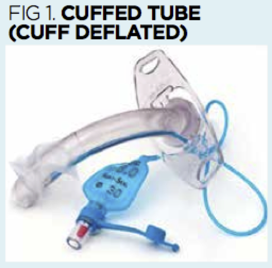
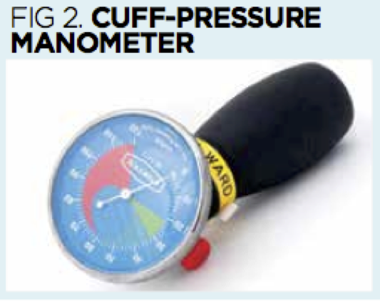
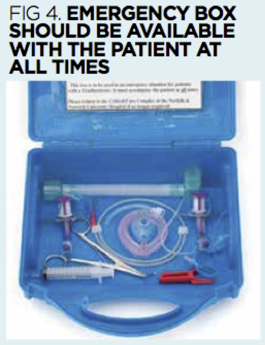
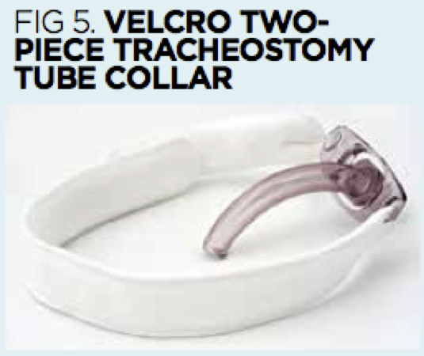
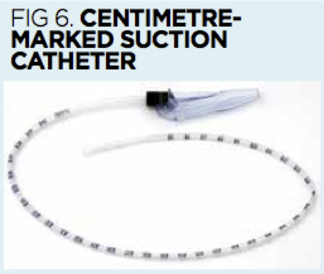
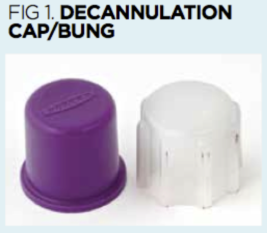
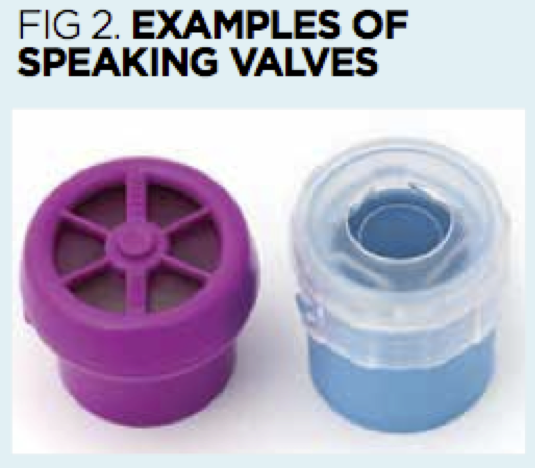

# PLACEHOLDER: add info on ETT, tracheostomy, nasal trumpet

# Endotracheal Intubation for the COVID-19 Patient

Watch the following video for an introduction to endotracheal intubation.

[Go to the video lecture](https://www.youtube.com/watch?v=iyAQR_Zpf6U&list=PLCT7BA-HcHljIaDw56FoqWILbqGCIxsmG&index=5)

# Question 1
Which artificial airway intubates both the trachea and esophagus?

[WRONG] Laryngeal mask airway (LMA)
[RIGHT] Combitube
[WRONG] Oropharyngeal airway
[WRONG] Tracheostomy tube

# Question 2
Which artificial airway is used for long-term airway management?

[RIGHT] Tracheostomy tube
[WRONG] Nasopharyngeal airway
[WRONG] Endotracheal tube
[WRONG] Laryngeal mask airway (LMA)

# Question 3
Which lab value must the nurse know for a patient who may receive succinylcholine?

[WRONG] Sodium
[WRONG] PaCO2
[WRONG] Calcium
[RIGHT] Potassium

# Question 4
Which of the following is not a method of confirming correct positioning of an endotracheal tube?

[WRONG] End tidal CO2 detector
[RIGHT] Asking patient to speak
[WRONG] Breath sounds
[WRONG] Chest x-ray

# Question 5
Identify one way to assist a patient with an artificial airway to communicate:

[WRONG] Tell family to take the patient’s glasses home
[WRONG] Encourage patient to talk
[RIGHT] Use a communication board
[WRONG] Teach the patient sign language

# Question 6
How often should the bite block be cleaned for a patient with an endotracheal tube?

[RIGHT] Every 8 hours
[WRONG] Every 2 hours
[WRONG] Every 24 hours
[WRONG] Every 4 hours

# Question 7
Which of the following is not a goal of tracheostomy care?

[WRONG] Prevent infection
[WRONG] Maintain airway patency
[RIGHT] Ensure that the patient can swallow
[WRONG] Prevent skin breakdown

# Tracheostomy 

# 1. Caring for patients with a tracheostomy
(The material in this section was adapted from this source: https://www.nursingtimes.net/clinical-archive/respiratory-clinical-archive/tracheostomy-1-caring-for-patients-with-a-tracheostomy-09-05-2016/)

Many nurses lack essential training to manage blocked or dislodged tracheostomy tubes. This article provides information on the care of patients with a tracheostomy

# What is a tracheostomy?
A tracheostomy is a temporary or permanent artificial opening (stoma) made into the trachea; 
a tracheostomy tube is inserted to maintain the patency of the stoma and the procedure can be performed either surgically or percutaneously. 
Surgical insertion is performed in theatre under general or local anaesthetic depending on the patient’s condition.

An opening is made into the anterior wall of the trachea, usually through the second-to-third or the third-to-fourth tracheal rings. 
A tracheostomy tube is then inserted to keep the stoma patent and the tube secured with sutures and/or tracheostomy collar.

Percutaneous insertion is performed in critical care units under sedation and local anaesthetic (NTSP, 2013). 
A needle is inserted through the neck into the trachea, then a guide wire is fed through the needle. 
The needle is removed and tract made bigger by dilators fed over the guide wire. When the stoma is large enough, the tracheostomy tube is fitted over the guide wire into the trachea, then the guide wire is removed and the tracheostomy tube secured with sutures and/or tracheostomy collar (Durbin, 2005).

Nurses caring for patients with tracheostomies must be aware of the insertion technique in case they are required to perform an emergency tube change; 
percutaneous guide wires should be available in the emergency tracheostomy box at the bedside.

It is important to know whether a tracheostomy is temporary (weanable) or permanent (non-weanable), as this will affect the plan of care. 
Nurses will provide regular tracheostomy care for patients with temporary tracheostomies, 
but patients with a permanent tracheostomy will also require education and training to manage their airway independently, where possible.

## Box 1. Indications for tracheostomy

 * Facilitate the removal of bronchial secretions
 * Secure airway in patients with major facial injuries
 * Secure airway following head and neck surgery
 * Secure airway in respiratory-tract obstruction due to, for example, a tumour or foreign body
 * Patients who are at high risk of aspiration, for example, patients with brain injuries
 * Enable long-term ventilation, for example, patients following spinal injury
 * Facilitate weaning from ventilator
 * Secure airway in head injury/stroke patients

# Tube types
Tracheostomy tubes are either single or double cannula (with an outer and inner cannula). 
The ICS (2014) notes that tracheostomy tubes with an inner cannula are inherently safer and are normally preferred. 
The double cannula allows routine inspection and clearance of secretions to prevent blockage of the tube, making it safer and easier to care for in a ward environment. 
Patients can be shown how to remove their own inner tube, and clean and replace it.

The outer diameter of the tracheostomy tube should be two-thirds to three-quarters of the tracheal diameter (NTSP, 2013). 
An adult female can accommodate a tube up to 10mm and an adult male up to 11mm.

Ideally the tube tip should be a few centimetres above the carina (a ridge at the base of the trachea separating the openings of the right and left main bronchi), 
and placement should be checked with an endoscope. If the tube is too short, there is a high risk of accidental decannulation and partial obstruction due to poor positioning; if it is too long, it can rub on or near to the carina, causing ulceration, continuous irritation and coughing. The diameters and lengths of tubes vary between manufacturers and although most hospitals tend to use one type of tube, it is prudent to have a variety available in case a model is inappropriate for a particular patient. In certain circumstances, a tracheostomy tube may need to be made specifically for patients whose needs cannot be met by standard tubes.

A connector at the opening of the tracheostomy tube enables airway equipment to be attached, such as catheter mount or bag valve mask.

## Cuffed and uncuffed tubes

Uncuffed tubes are used for patients who can protect their own airway and have an effective cough, and can clear secretions independently. Cuffed tubes are used to seal the trachea when positive pressure ventilation is used, and to reduce the risk of aspiration of secretions in patients who cannot protect their own airway, for example, due to vocal-cord palsy, swallowing dysfunction or brain injury. The cuffs are air-filled, low-pressure and soft to prevent trauma to the trachea (Fig 1, attached).

## Cuff-pressure manometer

A cuff-pressure manometer should be used to assess patency and effectiveness of cuffed tubes; this hand-held gauge can add or remove air as necessary (Fig 2, attached). Pressure should be maintained between 25-34cmH2O (ICS, 2008); it should be checked at least twice a day (St George’s Healthcare Trust, 2012). The pressure should be recorded on a daily tracheostomy care chart; any evidence of significant deflation (below 25 cmH2O) may indicate a problem with the tube and should be reported, and the tube changed by a competent practitioner if required. Likewise, overinflation of the cuff can cause tracheal wall damage and should also be reported and resolved as soon as possible.

A device, the Mallinckrodt Evac, enables the constant removal of secretions above the cuff and the constant monitoring of cuff pressure.

## Fenestrated tubes
These have either a single hole or multiple holes in the arc of the inner and outer tube to facilitate airflow up into the larynx, and improve voice quality. Many manufacturers make the inner fenestrated cannula coloured, usually red or green, to highlight its use. It should always be removed and replaced with a plain inner cannula with no fenestration holes prior to suctioning to prevent suction catheters passing through the holes and causing trauma to the trachea.

These tubes can cause hyper granulation of the posterior wall of the trachea, making removal and reinsertion of the inner tubes and routine tube changes difficult (St George’s University Hospitals Foundation Trust, 2015).

## Sub-glottic aspiration port

Some tubes have a small aspiration port running along the outside of the tube to just above the cuff (Fig 3, attached). A syringe attached to the port can be used to remove aspirated secretions and reduce the risk of ventilator-associated pneumonia (VAP) and aspiration pneumonia. The amount aspirated over a 24-hour period should be recorded and used to decide on further management interventions to dry up respiratory and oral secretions, and to improve patient comfort and aid tracheostomy weaning trials (weaning is discussed in part 2 of this series).

## Other devices
Some tubes have an adjustable flange that can be moved manually to increase/decrease the proximal length to accommodate deep-set tracheas, distorted anatomy due to tumours, inflammation, oedema or obesity.

Mini-tracheostomy uncuffed tubes with a diameter of 4mm are available to aid secretion removal and are inserted under local anaesthetic for conditions such as bronchiectasis.

# Tracheostomy care
Nurses need to understand all aspects of tracheostomy care, including routine and emergency airway management, safe decannulation, weaning and safe discharge into the community. The patient’s airway requires close monitoring 24 hours a day using a tracheostomy care chart to record care.

## Equipment and signage

The NTSP (2013) recommends that all patients with a tracheostomy have a bed-head label with information regarding their tube and airway, including whether it is surgical or percutaneous, the tube type, size and suction-catheter size, patency of the upper airway and whether the tracheostomy is temporary, permanent or involves a laryngectomy (removal of the larynx). Bed-head labels are available here.

Individual patients should have an emergency tracheostomy box, which should accompany them on transfer and on discharge into the community, and contain an appropriate tube size/type (Fig 4, attached). The box contains equipment to insert a new tube in the event of dislodgement or blockage. Other equipment required at the bedside includes lubricating gel to aid insertion, cuff-pressure manometer, spare tracheostomy dressings and collars, Tilley forceps and a pen torch (McGrath et al, 2012). Equipment should be checked daily.

## Securing the tube

A tracheostomy tube can be held in place by several different methods. At initial insertion, the tracheostomy will be held in place by suture and, in addition, a collar or twill ties may also be used. Once the sutures are removed, the tracheostomy must be secured in place by a Velcro collar or twill ties.

Securement devices should be checked once a shift, or more frequently, if a patient is at risk of pulling on the collar/ties, for example, confused patients; ensure that they are not too tight or too loose – as a guide, two fingers should be able to fit down one side of the collar/twill ties.

The edges of the tracheostomy flange may cause small ulcerations if the collar/twill ties that hold the tracheostomy tube in place are too tight, or where the flange sits on the collar bone.

It is important to check the back and sides of the neck frequently for reddening or pressure ulcers caused by the securement device. Soft Velcro collars with adjustable tabs can help to reduce this risk (Fig 5, attached) .

Cotton twill ties are recommended for patients who are at risk of self-decannulating; twill and foam collars combine the softness of a Velcro collar with the robustness of the twill, enabling them to be tied and knotted into place through the flange, and hold the tracheostomy tube securely.

## Inner-cannula care
When a double lumen tube is used, the inner cannula should be removed and cleaned every 2-4 hours depending on the quantity and tenacity of secretions; if these are copious, the inner cannula will require more frequent checks and cleaning, which should be done using the manufacturer’s cleaning aids. Some inner cannulas are single-use only and should be replaced at each check. When using reusable tubes, a clean tube must be available at all times at the bedside to ensure that a “one in, one out” system is used, so that an inner cannula is in-situ at all times. Dirty inner tubes should be cleaned according to local infection-prevention guidance.

#### Stoma care
Patients with a tracheostomy are particularly susceptible to respiratory and stoma infections. Leakage of respiratory track secretions around the stoma site causes a damp, moist environment that harbours bacteria, and colonisation of the site is common. Skin can also become macerated and excoriated.

The stoma site should be checked at least once a day, or more frequently if required, and this requires two nurses: one to hold the tube and one to clean the stoma site. The site should be cleaned using a tracheostomy wipe or with 0.9% sodium chloride solution, and dried thoroughly. It should be monitored for any signs of infection such as offensive-smelling exudate, redness, pain and swelling, and the patient monitored for systemic signs such as pyrexia and feeling unwell. Evidence of infection should be documented and microbiology swabs sent for culture (McGrath et al, 2012) to ensure appropriate antibiotics are prescribed.

Specifically designed tracheostomy stoma dressings, placed under the flange and around the stoma site, should absorb secretions and provide a buffer to the flange edges to prevent ulcers. However, bulky foam dressings should be avoided, as they increase the risk of tube dislodgement.

A film-forming acrylate barrier, such as Cavilon No Sting Barrier Film, can be applied to broken skin; it helps to protect the stoma site from wet secretions and reduces the risk of maceration.

## Humidification
As air passes through the mouth and the nose, it is warmed, filtered and moistened. Breathing via a tracheostomy bypasses the nose and mouth, so artificial humidification is crucial to keep the tracheostomy tube patent; humidification methods are outlined in Box 2.

## Box 2. Humidification

### Heated humidification

Ensures that inspired gas is delivered fully saturated and at core body temperature; the most effective system when secretions are tenacious and dry.

### Cold humidification

Only delivers approximately 50% humidity to inspired gas, therefore less effective than heated systems. However, significantly more cost-effective than heated systems for short-term use.
   * Sodium chloride 0.9% nebuliser: A nebuliser turns sodium chloride 0.9% into supersaturated aerosol of liquid droplets. These droplets penetrate the lungs, moistening the airways. A dose of 5mls of sodium chloride 0.9% every two-to-four hours, and as required, should be prescribed for every tracheostomy patient (National Tracheostomy Safety Project, 2013).
   * Heat moisture exchanger devices: These attach directly onto the tracheostomy tube. Inspired gas passes through the device and is filtered, moistened and heated (Fig 7, attached). The expired gas provides the device with the heat and moisture. These should be changed at least every 24 hours, or as needed, to prevent accumulation of secretions.
   * Stoma bibs: These foam bibs absorb moisture from the expired air, filter and moisten inspired air. Patients like them, as they cover the tracheostomy tube.
This is particularly important when the tracheostomy is permanent, and there are issues with body image and social reintegration. The bib can be moistened with a water spray.

## Box 3. Indications for suctioning
Noisy breathing, audible secretion sounds
Ineffective, spontaneous cough
Aspiration of gastric or upper-airway secretions
Increased work of breathing (rate, rhythm and effort). May be due to difficulty tolerating speaking valve (see part 2), or a blocked tube.
Pulmonary atelectasis (lung collapse), or consolidation due to secretion retention
Low oxygen saturation could indicate blockage, displacement or a respiratory problem such as a chest infection
During synchronised cuff deflation (see part 2)
At patient’s request

## Suctioning

Suction should only be used for patients who are unable to clear their own secretions into their tracheostomy tube (Box 3) (Pryor and Prasad, 2008).

It is essential to encourage patients to cough and clear their own secretions. Staff should be competent in using suction to remove secretions from the tracheostomy tube, as well as deep suctioning – which may be required for patients who are desensitised and require stimulation to expectorate secretions, or who have a poor cough and struggle to clear secretions to the level of the tracheostomy tube.

Face protection in the form of a fluid shield mask or a separate goggles/mask combination should be worn when performing suctioning, and a non-touch aseptic technique should be used.

The suction unit should be set to no more than 20kpa/120mmHg for an adult (NTSP, 2013). Those with high oxygen requirements may need pre-oxygenation to minimise the risk of acute hypoxia during the procedure (Dougherty and Lister, 2015).

Suction should be given for no more than 10 seconds to reduce the risk of hypoxia, cardiac arrhythmia and bronchospasm/constriction. It should only be applied on withdrawal of the suction catheter to reduce the risk of mucosal irritation and damage (McGrath et al, 2012). Suction catheters are a sterile, invasive piece of equipment and should therefore be discarded after single use.

The use of centimetre-marked suction catheters allows the catheter to be passed to a predetermined depth, thereby reducing the risk of tracheal and bronchial mucosal damage (Fig 6, attached).

Deep suctioning should be avoided where possible to reduce the risk of mucosal damage and inflammation.

The size of the suction catheter required can be worked out by using a simple equation (there are others); for example:

* Tube size - 2 x 2 = suction catheter FG

* EXAMPLE: 8-2 = 6 x 2 =12 FG

Suction should be given no more than three times consecutively to reduce the chance of hypoxia, cardiac arrhythmia, pulmonary atelectasis, bronchoconstriction/spasm, elevated intracranial pressure, hyper/hypotension, cardiac or respiratory arrest (Higgins, 2009; ICS, 2014).

Local policies and procedures should be followed when using suction and all interventions should be recorded along with sputum tenacity, viscosity, colour and odour. A sputum trap can be used to send a sample if concerns arise.

Any difficulty in passing a suction catheter requires immediate attention to assess if the tube is blocked or has been displaced (ICS, 2014).

## Hydration and oral hygiene
Hydration is an important part of tracheostomy care, as dehydration can result in secretions becoming thick and dry, increasing the risk of a blocked tube.

The majority of patients with a tracheostomy will be nil by mouth, and regular mouth care is essential in preventing problems, such as mouth ulcers and oral thrush. Poor oral hygiene is also associated with VAP and daily use of 0.12% chlorhexidine gluconate mouthwash or gel is recommended (Conley et al, 2013).

Contaminated tracheal secretions can leak past the inflated tracheal cuff and into the lungs, causing aspiration pneumonia.

# Conclusion
Training is essential in all acute and community care settings to ensure that patients with tracheostomies receive appropriate care. Cohorting of tracheostomy patients reduces the number of staff needing training and enables staff to maintain their skills and confidence. Ward areas should have appropriate equipment to ensure safe and effective tracheostomy care.Patients should have a bed-head sign and relevant algorithms available for use in an emergency. An emergency tracheostomy box should be available for all patients with tracheostomies on critical care units, wards or at home.

# Key points
 * A tracheostomy is a temporary or permanent artificial opening in the trachea
 * Patients with a tracheostomy follow a complex pathway through critical care to general wards
 * Half of tracheostomy-related deaths are due to displacement of tubes
 * All patients with a tracheostomy should have a bed-head label with information about their tube and airway management
 * An emergency tracheostomy box should accompany patients on transfer

# 2. Managing the weaning of a temporary tracheostomy
(The material in this section was adapted from this source: https://www.nursingtimes.net/clinical-archive/respiratory-clinical-archive/tracheostomy-1-caring-for-patients-with-a-tracheostomy-09-05-2016/)

Removal of a temporary tracheostomy can cause anxiety for patients. Weaning and decannulation requires careful planning, and the support of a multiprofessional team

# Introduction
The majority of tracheostomies are inserted as a temporary respiratory support measure. Many patients will have their tube removed, a process known as decannulation, on the critical care unit; however, weaning programmes can take place at ward level. It is vital that staff are competent and have an understanding of the weaning process, risks and weaning accessories, such as speaking valves and decannulation caps/bungs.

Tracheostomy multidisciplinary teams (MDT) can manage the weaning process for temporary tracheostomies, ensuring the plans are safe and manageable, both for the patient and ward staff.

# Indications
A temporary tracheostomy is required for short-term respiratory support and can be placed either surgically or percutaneously. Where possible, it is best practice to meet the patient pre-operatively to discuss the tracheostomy tube insertion, tracheostomy tube-care needs and weaning/decannulation process. Temporary tracheostomies may be performed electively as part of a planned procedure, for example, following some maxillofacial and ear, nose and throat procedures. They are also used to protect the airway of patients who are unable to swallow and clear their own secretions, and who are at risk of aspiration; for example, patients who have had a stroke or brain injury are at particular risk.

# Infection
Patients with a tracheostomy are more susceptible to respiratory-tract infections due to the loss of air filtration through the nose – particularly when they have a cuffed tracheostomy tube in-situ – and temporary tubes should be regularly reviewed and removed, as soon as it is safe to do so.

# The weaning process
The aim of the weaning programme is to gradually return airflow to the upper airway and restore normal physiological functions (National Tracheostomy Safety Project, 2013). Patients need to be weaned off their tracheostomy but deciding when to begin this process is hard to judge (NTSP, 2013). The weaning process is individual and may take days, weeks or occasionally months to complete. It is essential that care providers have locally agreed tracheostomy weaning and decannulation guidelines and charts, and a multidisciplinary approach that provides ongoing support for the patient and staff.

When the indications for the temporary tracheostomy tube have been resolved, the patient will be assessed by the MDT and, if suitable, a weaning programme will begin. The assessment criteria are listed in Box 1. All actions and variances should be clearly documented on a tracheostomy weaning chart, which should provide clear guidance for the weaning programme. Informed consent should always be obtained, if possible, prior to commencing any aspect of the tracheostomy weaning programme.

If there are known difficulties with the patient’s airway, such as stenosis or vocal cord palsy, or previous problems with decannulation, it is advisable to endoscopically review the upper airway prior to commencing a weaning programme; the patient should be monitored closely once a programme starts. Contraindications for weaning are outlined in Box 2.

## Box 1. Assessment criteria for weaning

 * Has the reason for the tracheostomy been resolved?
 * Is the upper airway patent (may require endoscopic assessment)?
 * Can the patient protect their own airway?
 * Do they require ventilator support?
 * Are they haemodynamically stable?
 * Are they infection free?
 * Do they have any known respiratory disease that may require consideration when agreeing a weaning programme?
 * Can they cough and clear secretions independently?
 * Is their chest condition stable?
 * Do they maintain oxygen saturations to an agreed percentage?
 * Do they have any forthcoming, planned procedures requiring an anaesthetic in the next 7-10 days?
 * Is the care environment suitable to commence a tracheostomy weaning programme?
 * Is the patient able to swallow? Speech and language therapist should perform a swallow assessment
Source: adapted from NTSP, 2013

## Box 2. Contraindications for removal of a temporary tracheostomy

 * Unable to tolerate cuff deflation
 * Airway obstruction
 * Medically unstable
 * Severe anxiety about removal of the tube
 * Cognitive impairment
 * Severe laryngeal/tracheal stenosis
 * End-stage pulmonary disease
 * Risk of severe aspiration/recurrent aspiration pneumonia

Source: St George’s Healthcare Trust, 2012

# Weaning considerations
## Tracheostomy tube size
Patients with a large tube, for example, a 9mm OD (outer diameter) cuffed, need to step down to the next size (8.5/8mm OD cuffed, depending on the manufacturer), and then repeat as required until they have reached 7.5mm OD for men and 6.5mm OD for women. Weaning aids, used to seal the end of the tubes, are only suitable with these smaller sizes. The small tubes create a space between the tube and trachea, allowing air to bypass the tube and pass through the upper airways when weaning aids are in place (NTSP, 2013).

## Cuff deflation
Once an appropriately sized tracheostomy tube is in place, trial cuff deflations can begin. It is important to note that when a cuffed tracheostomy tube has been in-situ for a period of time, the re-introduction of airflow to the upper airway on deflation of the cuff can cause irritation, constant coughing and distress to the patient (NTSP, 2013). The initial time of cuff deflation will depend on the patient’s response.

A synchronised cuff-deflation technique should be used every time the cuff is deflated and requires two competent practitioners. As the cuff is deflated using a 10ml syringe, suction is given via the tracheostomy tube to remove any secretions that come from above the cuff into the trachea. If the patient has a tracheostomy tube with a subglottic port, it should also be aspirated prior to the cuff deflation to remove secretions above the cuff. When a standard cuffed tube is used, oral suction should be performed prior to cuff deflation (for further information on tubes types, see part 1, Everitt, 2016). Continuous monitoring of oxygen saturation levels is essential, as these may fall during the weaning process. Oxygen saturation levels should be maintained at the target levels identified by the MDT. Oxygen should be administered if required at the prescribed rate.

## Using uncuffed tube

When the patient is able to tolerate the cuff being deflated for 24 hours, the tracheostomy tube may be replaced with an uncuffed tracheostomy tube  to enable more air to bypass the tube and enter the larynx. Weaning aids, such as decannulation caps/bungs (Fig 1, attached), can then be used to seal the end of the tracheostomy tube completely; if the patient copes with the cap/bung, then the tracheostomy tube may be removed with the agreement of the MDT.

If a decision is made to continue to use a cuffed tube, it is important to check that the cuff is fully deflated before using a cap/bung or other device, such as a speaking valve, otherwise the patient will not be able to breathe and this could result in death.

## Creating speech

An inflated cuffed tracheostomy tube will prevent air from entering the larynx and passing through the vocal cords; as a result, patients are unable to speak. Patients can use a finger to occlude their tracheostomy tube to enable speaking during periods of cuff deflation; this can also help the MDT to decide whether they are able to start a weaning programme. If the patient struggles with finger occlusion, they are not ready to start using speaking valves and a repeat review of their upper airway may be required before trial cuff deflations.

The use of aids, such as speaking valves, can help patients to vocalise (Fig 2, attached). These valves are “one way” and allow air to be inspired via the tracheostomy tube; on the outward breath, the valve closes and the air is expired via the upper airway. The use of speaking valves can cause the patient to tire easily because of the effort required to force expired air through the windpipe. This should be factored into the weaning programme, and the periods using the speaking valve gradually increased. Speaking valves should be removed if there is oxygen desaturation, respiratory distress, fatigue, and if the patient requests for the valve to be removed (St George’s Healthcare Trust, 2012). For further information on speaking valves, see part 3.

## Unsuccessful weaning
A weaning programme can fail with the initial cuff deflation or when decannulation is attempted. Patients may cough continuously following cuff deflation, their oxygen saturation levels fall and they become distressed. If this occurs, the weaning programme should be discontinued immediately and an MDT reassessment undertaken. This may include a repeat endoscopic assessment of the upper airway and further respiratory assessments.

## Decannulation
Decannulation should only be undertaken when the patient has successfully completed the weaning programme and the MDT have confirmed that it is safe to remove the tracheostomy tube. Key points for decannulation are outlined in Box 3.

## Box 3. Key points for decannulation

 * Local weaning and decannulation policies should be followed
 * Decannulation should only take place when specialist staff are available.
 * Staff able to reinsert the tracheostomy in a post-decannulation emergency should be available in the clinical area during and following the decannulation
 * There should be clear documentation in patients’ notes of MDT assessments, interventions and plans, and a weaning chart should be available
 * Where possible, informed consent for decannulation should be obtained
 * A competent practitioner should remove the tracheostomy tube
 * Bed-head signs should be in place with an emergency algorithm on the back to follow
 * An emergency tracheostomy safety box and bedside equipment, including suction catheters, Tilly’s forceps and suction apparatus should be available for 48 hours post-decannulation
 * Nasogastric feeding should be stopped four hours prior to decannulation to minimise risk of aspiration
 * Monitoring of physiological observations using the national early warning score system should be carried out for 24 hours following decannulation (Royal College of Physicians, 2012). Concerns should be escalated immediately
 * The use of weaning programmes should reduce the risk of failed decannulation
Source: NTSP, 2012

# Post-decannulation care
Once the tracheostomy tube has been removed, the stoma site should be cleaned with 0.9% sodium chloride and dried, and an occlusive dressing applied according to local policy. If sutures have been used to hold the tube in-situ, they should be removed. The dressing should be changed daily but it may require frequent re-application during the initial period, as exhaled air pressure on the dressing from the stoma opening may cause it to become loose. Observe the site for signs of infection.

The stoma can take two-to-six weeks to heal but occasionally a small trachea-cutaneous fistula may be present several weeks later and this may need to be closed surgically. Once the site has fully healed, the patient will be left with a small scar.

The patient is required to press on the dressing directly over the stoma when talking or coughing to occlude the stoma fully and reduce expired air passing through the stoma, enabling the patient to have a stronger voice and cough, and help the stoma to heal.

# Psychological care
Reaching the stage for weaning is a major point in the recovery process, as for many patients and relatives the restrictions of the tracheostomy tube supersede any other medical problems or diagnosis that they have. A successful weaning programme means that social and communication restrictions are lifted for both the patient and their relatives. Griffiths et al (2005) found that good management of a patient with a tracheostomy, both in hospital and in the community, has a significant impact on quality of life.

Many patients who have a tracheostomy tube are aware of their altered body image; this can cause a sense of social isolation and a feeling of reclusiveness. The removal of the tracheostomy tube reinstates a sense of normality, both physiologically and psychologically. However, upon starting a weaning programme patients can become extremely anxious and concerned they will be unable to breathe without the tube. This is a particular issue for patients who have had failed decannulation attempts. It is therefore important that practitioners discuss each step of the weaning programme with the patient and any fears or concerns they have. MDT meetings are useful to update the family and patient of plans and allow them to ask questions or raise concerns. It is the joint responsibility of all members of the MDT to develop a trusting relationship with patients and their relatives/carers.

Hashmi et al (2010) found that self-image in patients undergoing elective tracheostomy could be improved using a pre-operative psychological assessment. A decline in mental health post-operatively was attributed to worsening self-esteem. The study also highlighted that patients undergoing unplanned tracheostomy insertion experienced both mental and physical decline post-operatively.

# Conclusion
A multidisciplinary approach to tracheostomy weaning will ensure safe and appropriate programmes are agreed and put into practice. The MDT also provides routine reviews of the patients’ progress and makes amendments to programmes, as required. Nurses involved in weaning and decannulation processes need to have appropriate skills to care for tracheostomised patients, and respond to their concerns and changes in their clinical condition. Psychological assessments should be used in elective pre-operative assessments as a benchmark.

# Key points
 * A temporary tracheostomy is required for short-term respiratory support
 * Weaning charts should be used to record details of the weaning programme
 * All staff should be made aware of the weaning programme and required equipment
 * NTSP bed-head labels should be used to clarify whether the tracheostomy tube is temporary or permanent
 * Pre-operative psychological assessment should be carried out for all patients undergoing a planned tracheostomy procedure

