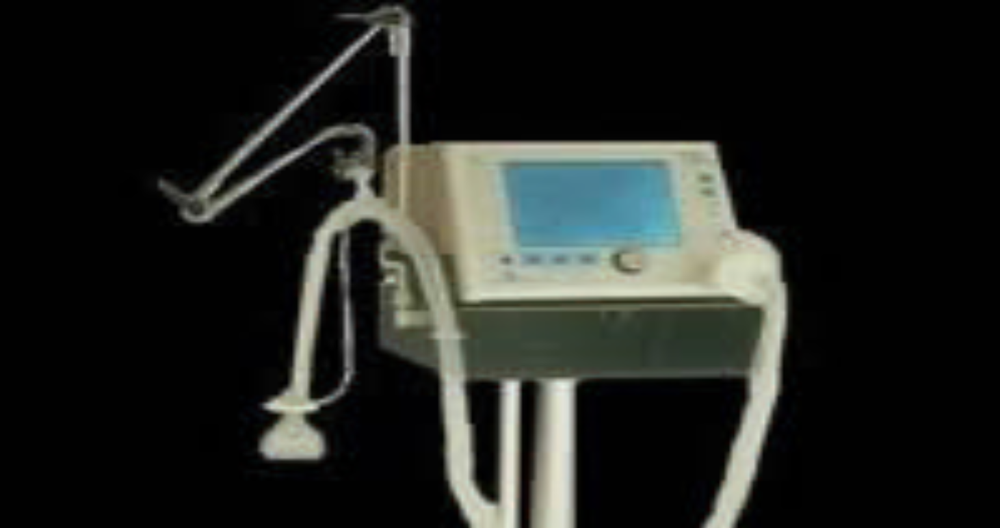
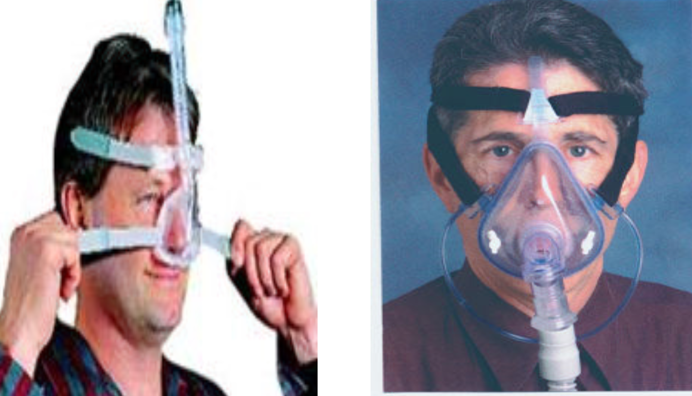

# Non-Invasive Positive Ventilation

It is a method of ventilation without intubation: tight-fitting nasal, oro-nasal or face mask attached to a non-invasive pressure support ventilator (NIPSV or BIPAP) unit.

The unit is programmed to set back-up:

* Respiratory rate
* Inspiratory positive airway pressure(IPAP)
* Expiratory pressure (EPAP)
* Supplemental FiO2 to maintain O2 sat > 92%

# Bilevel Positive Airway Pressure (BiPAP)
Delivers different pressure depending on whether the patient is taking a breath of exhaling.

BiPAP Machine

BiPAP Masks

# Continuous Positive Airway Pressure (CPAP)
* Increases Oxygenation Level
* Decreases breathing workload
* Increases intrathoracic pressure which will lower preload thereby lowering cardia workload

Aerosolized Intervention: Use N95 mask when caring for patients using either BiPAP or CPAP.

# Question 1
What type of mask should be used when caring for patients who use BiPAP or CPAP machines?

[RIGHT] N95 respirator mask
[WRONG] Standard surgical mask
[WRONG] Full face mask