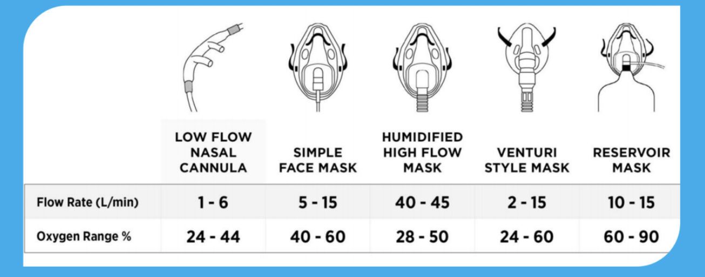
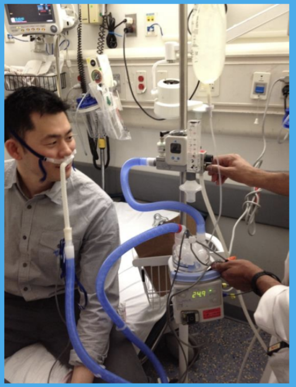

## Non-Aerosolized Oxygen Delivery Systems

These are used for patients that need supplemental oxygen and are breathing on their OWN.

#### Nursing Implications

* Dries the airway, thickening secretions and making it difficult for the patient to cough up
* Increases Infection Risk of the Patient
* Can cause patient discomfort

## Aerosolized Oxygen Delivery System: High Flow Nasal Cannula

* You must use N95 when caring for patients on HFNC.
* Set flow 10-50L
* FiO2: 21-100%
* No Alarms
* #1 issue is cannula kinks
 *If FiO2 goes higher than
       originally set, there might be
       a kink on the cannula prongs

#### Benefits of HFNC

* Reduces
    * Respiratory rate
    * Carbon dioxide level
    * Breathing effort
* Increases
    * Tidal volume
* Improves
    * Mucus clearance
    * Oxygenation