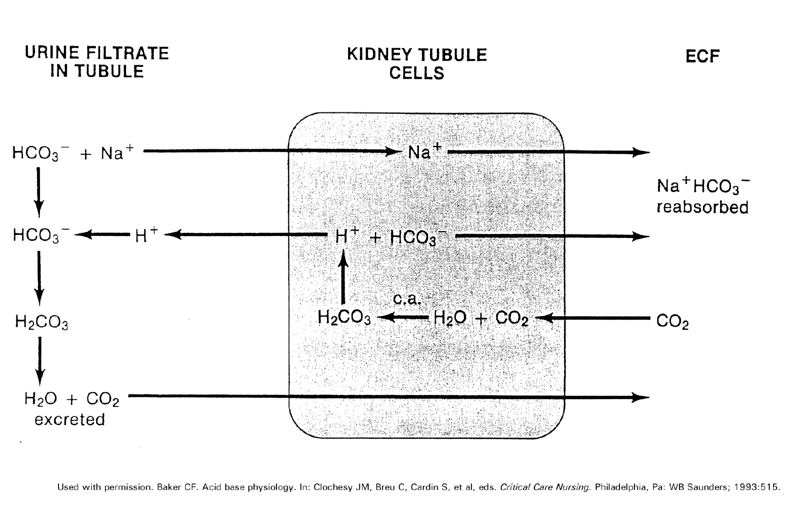
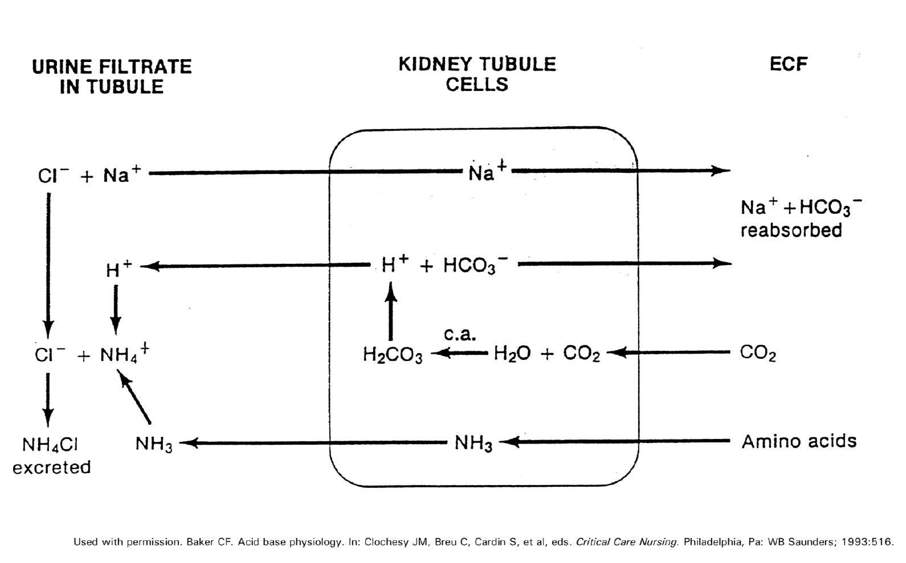
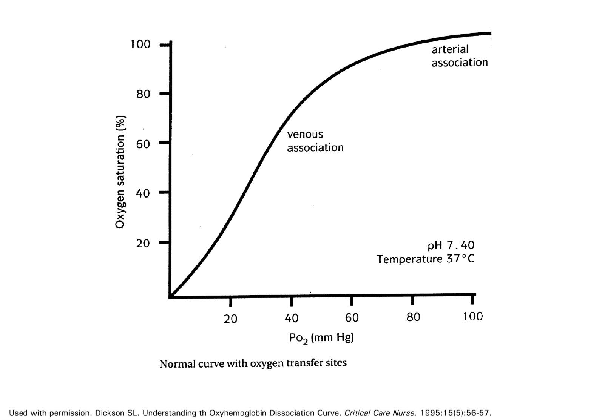
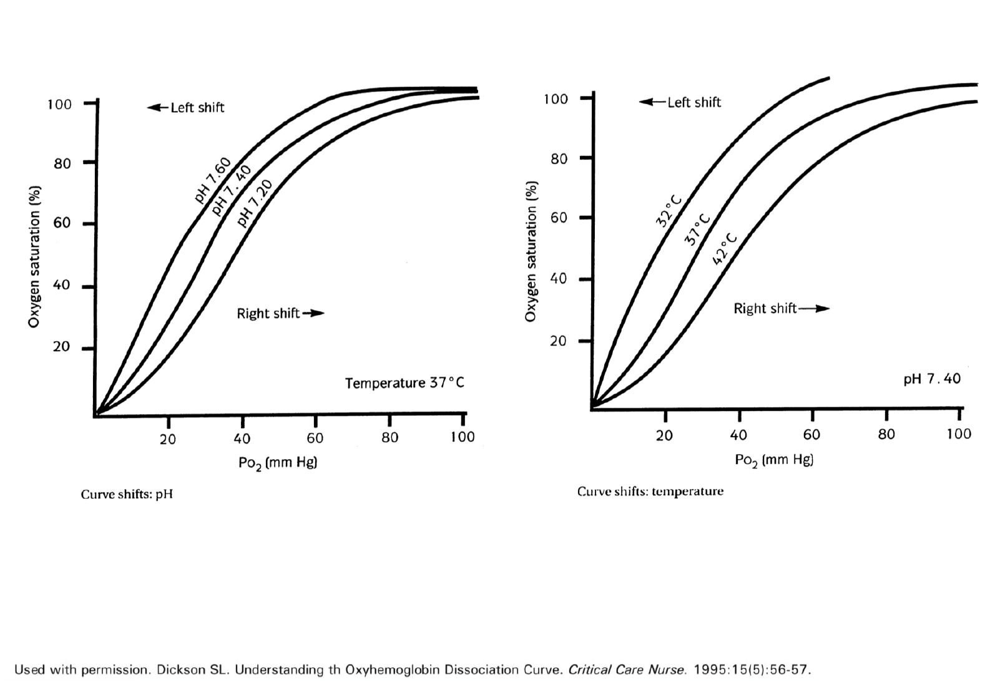

# Acid Base Terminology

* Acid: Donates a hydrogen ion (H+)
* Base: Accepts a hydrogen ion (H+)
* pH: Negative logarithm of the hydrogen ion concentration
* Arterial Blood Gas: Used to assess acid base 
* Mixed Venous Blood Gas: 
 * Sampled from a Pulmonary Artery Catheter
 * Used to assess tissue oxygenation

# Normal Arterial Blood Gas Values
* pH: 7.35-7.45
* PaCO2: 35-45 mm Hg
* HCO3- : 22-26 meq/l
* Base Excess: -2 to +2
* PaO2: 80-100 mm Hg
* SaO2: 95% or greater

At sea level, pH = 7.4, temperature = 37C, PaCO2 = 40 mm Hg

# Acidemia vs. Alkalemia

### Acidemia
* pH < 7.35
* Accumulate too much acid or lose too much base
* pH < 6.8 incompatible with life

### Alkalemia
* pH > 7.45
* Accumulate too much base or lose too much acid
* pH > 7.8 incompatible with life

# Buffers

## Carbonic Acid

## Protein

## Phosphate

# Respiratory System

### Effects of Changes in Ventilation

* Hypoventilation -> ↑CO2 Retention -> Acidemia
* Hyperventilation -> ↓CO2 Retention -> Alkalemia

### Influence of Non-Respiratory Acid Base Disturbances on the Respiratory System

* Non-respiratory Acidosis -> Increased Ventilation
* Non-respiratory Alkalosis -> Decreased Ventilation

# Renal System

### Metabolic Causes of Acidosis

* Will see: ↓HCO3- or ↑H+
* Kidneys increase excretion of H+ and retention of HCO3-

### Metabolic Causes of Alkalosis

* Will see: ↑HCO3- or ↓H+
* Kidneys increase excretion of HCO3- and retention of H+

# Tubular Controls

### Tubular Control of H+ by the Bicarbonate-Carbonic Acid System

### Tubular Control of H+ by Phosphate

### Tubular Control of H+ by Ammonia

# Correction vs. Compensation

### Correction

* Primary disorder is repaired. All acid base parameters return to normal.

### Compensation

* Primary disorder continues, opposite system begins to adjust
* Attempts to restore ratio of 1 part acid to 20 parts base
* Can be partial or complete compensation

# Steps to Acid Base Interpretation

### Analyze each acid base parameters. 

* pH, PaCO2, HCO3-: low, normal, high?

### Match acid base disturbance with parameter causing disturbance

* pH↓ and PaCO2↑ = Respiratory Acidosis
* pH↑ and PaCO2↓ = Respiratory Alkalosis
* pH↓ and HCO3-↓ = Metabolic Acidosis
* pH↑ and HCO3-↑ = Metabolic Alkalosis

### Look for Compensation

* All variables are abnormal
* Either the PaCO2 or the HCO3- abnormality would cause the acid base change
* The opposite system has changed in a manner that would have caused the opposite pH change
* Example 1: 
 * pH < 7.37
 * PaCO2↓
 * HCO3-↓
 * Disturbance: Metabolic Acidosis with Respiratory Compensation
* Example 2:
 * pH < 7.37
 * PaCO2↑
 * HCO3-↑
 * Disturbance: Metabolic Alkalosis with Respiratory Compensation

### Look for Combined Disorders

* All acid base parameters are abnormal
* Both the PaCO2 and HCO#- would have caused the pH to change in the manner that occurred

# Respiratory Acidosis

### Blood Gas Values

* pH < 7.35
* PaCO2 > 45 mm Hg
* HCO3- normal or elevated

### Causes (Alveolar Hypoventilation):

* Depression of the respiratory center
* Respiratory muscle paralysis
* Chest wall disorders
* Disorders of the lung parenchyma
* Alteration in the function of the abdominal system

### Signs and Symptoms:

* CNS Depression
* Muscle twitching which can progress to convulsions
* Arrhythmias, tachycardia, diaphoresis
* Palpitations
* Flushed skin
* Electrolyte abnormalities

### Compensation

* Increased H+ secretion and increased HCO3- reabsorption

### Treatment

* Increase/improve ventilation

# Respiratory Alkalosis

### Blood Gas Values

* pH > 7.45
* PaCO2 < 35 mm Hg
* HCO3- normal or decreased

### Causes (Alveolar Hyperventilation):

* Psychogenic
* CNS Stimulation
* Hypermetabolic states

### Signs and Symptoms:

* Headache
* Vertigo
* Paresthesias, carpal pedal spasm and tetany
* Tinnutis
* Electrolyte abnormalities

### Compensation

* Decrease H+ secretion and increased HCO3- excretion

### Treatment

* Slow the hyperventilation

# Metabolic Acidosis

### Blood Gas Values

* pH < 7.35
* PaCO2 normal (rarely) or decreased
* HCO3- < 22 meq/l

### Causes (increase in H+ or an excess loss of HCO3-):

* Overproduction of organic acids
* Impaired renal excretion of acid
* Abnormal loss of HCO3-
* Ingestion of acid

### Signs and Symptoms:

* CNS Depression
* Cardiac Arrhythmias
* Flushed skin
* Nausea
* Electrolyte abnormalities

### Compensation

* Lungs increase ventilatory effort

### Treatment

* Cause specific
* Assess hemodynamic and respiratory status
* Careful administration of NaHCO3

# Anion Gap

Definition: Unmeasured anions in the serum

Calculated: (Na+ + K+) - (HCO3- - Cl-)

Normal Value: 12 ± 2

Acidosis with increased anion gap: Accumulation of anions other than Cl-

Acidosis with normal anion gap: Renal absorption of Cl- due to the loss of HCO3-

# Metabolic Alkalosis

### Blood Gas Values

* pH > 7.45
* PaCO2 normal (rarely) or increased
* HCO3- > 26 meq/l

### Causes (A loss of hydrogen ions or an increase in HCO3-):

* Large losses of gastric contents
* Loss of potassium chloride
* Ingestion of large amounts of bicarbonate
* Prolonged use of diuretics

### Signs and Symptoms:

* Diaphoresis
* Nausea and vomiting
* Increased neuromuscular excitability
* Shallow breathing
* EKG changes
* Confusion, lethargy to coma
* Electrolyte abnormalities

### Compensation

* Decrease in respiratory rate and depth of ventilation to retain CO2

### Treatment

* Underlying cause must be corrected

# Arterial and Mixed Venous Gases

# Oxyhemoglobin Dissociation Curve

### Causes of Shifts

# Factors Leading to Tissue Hypoxia

* Low cardiac output
* Decreased oxygen carrying capacity
* Non-functional hemoglobin
* Right to left cardiac shunt
* Impaired respiration

# Body's Compensation for Tissue Hypoxia

* Tachycardia
* Tachypnea
* Erythrocytosis
* Further desaturation of hemoglobin

