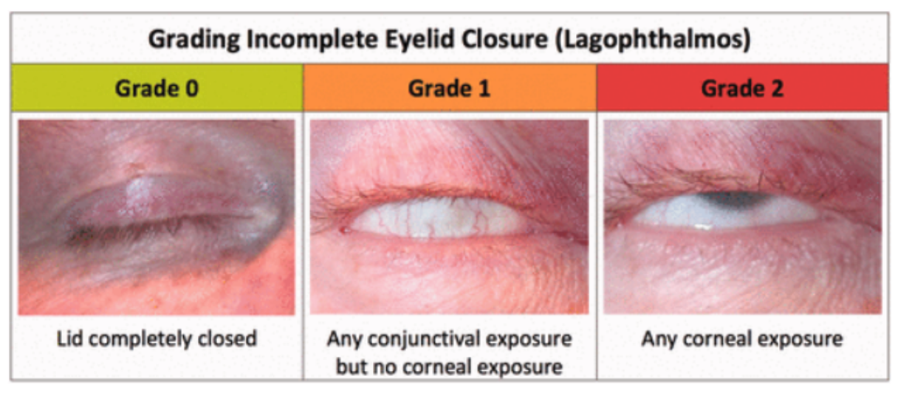
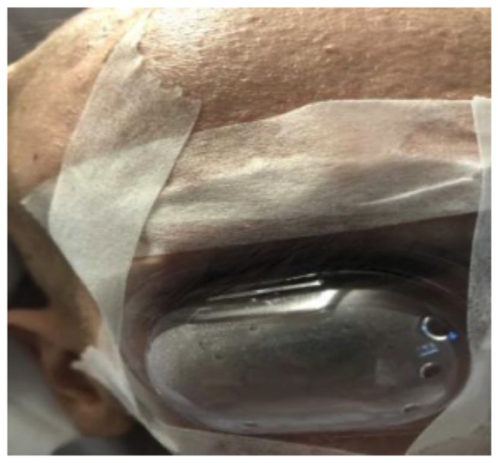

# Interventions Pt. 1

* Frequent monitoring of vital signs

* Maintain airway with supplemental oxygen or mechanical ventilation

* Correct fluid/electrolyte imbalances

* Turn/position every 2 hours to: 
 * Promote adequate ventilation and perfusion to the lungs
 * Prevent skin breakdown
 
* Prone position for selected patients

* Oral Care (every 4 hours vented, every 6 hours non-vented)

# Interventions Pt. 2

* Eye care for the prevention of **Ocular Surface Disease (OSD)**
 * There are many risk factors for OSD, some of which maybe fluid maldistribution(edema, altered level of consciousness, paralytics, etc.)

* Assessment of eyelid closure must be done regularly throughout the patient’s stay

* The main aim of this assessment if to grade the severity of incomplete eyelid closure (lagophthalmos)

* All ventilator dependent patients with either a endotracheal tube/tracheostomy should receive Lacrilubeevery 4 hours while on the ventilator.

* Patients with Grade 1 or Grade 2 lagaphthalmosin addition require an eye shield covering the eye, taped and sealed on all sides

