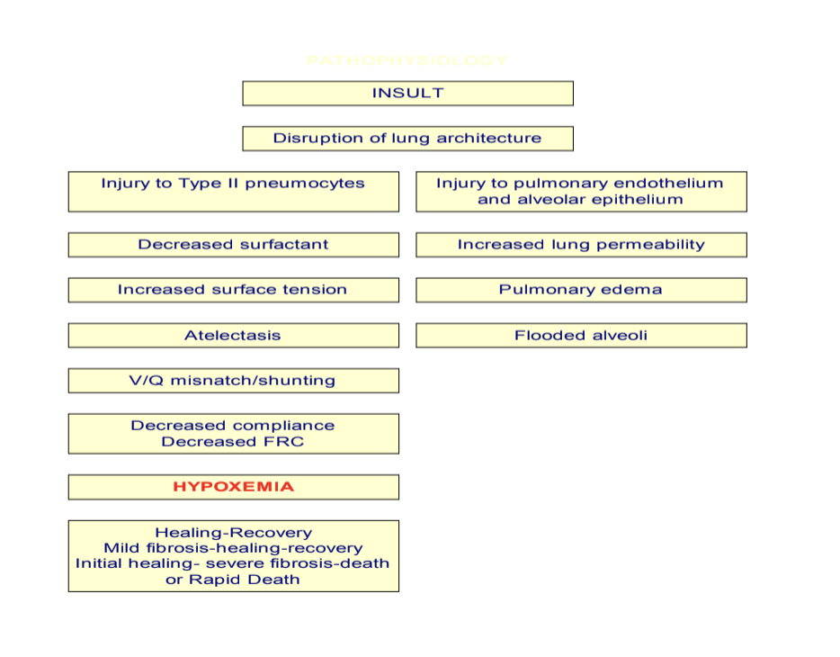
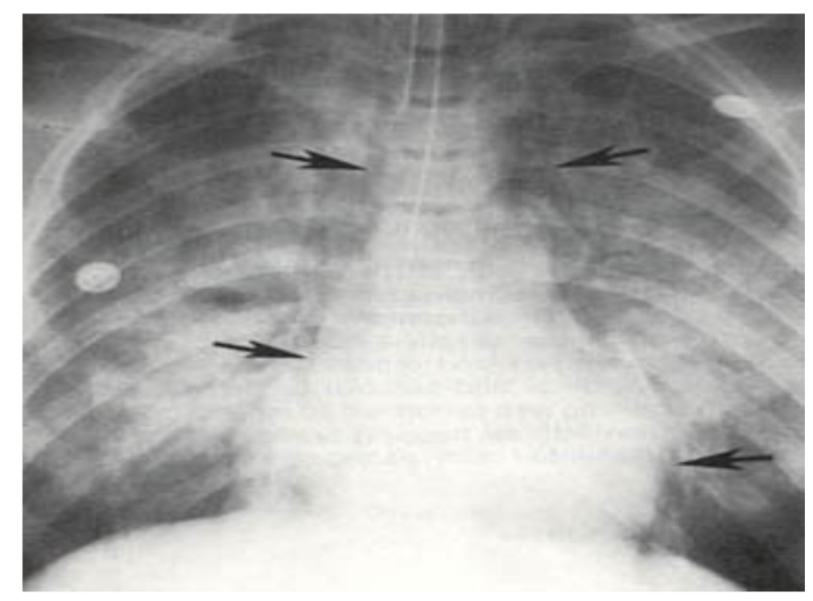
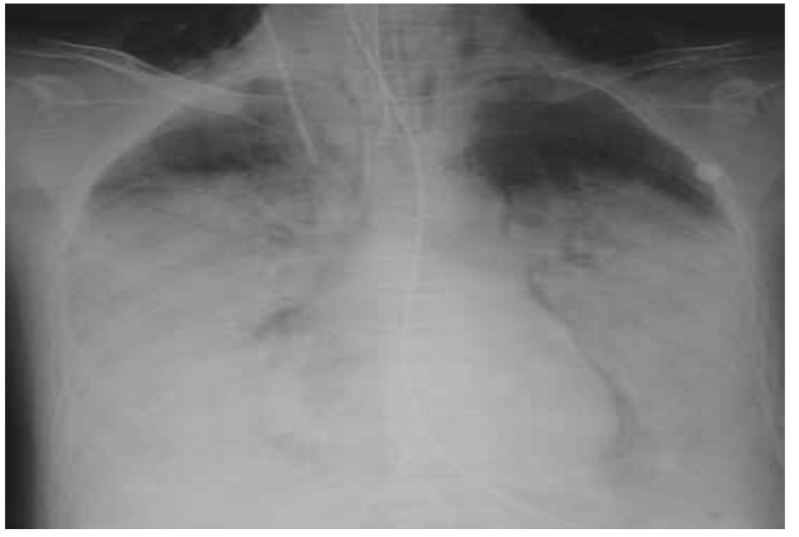
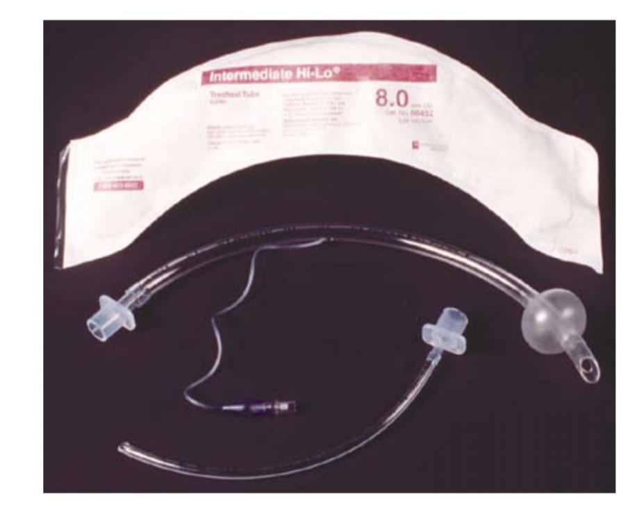
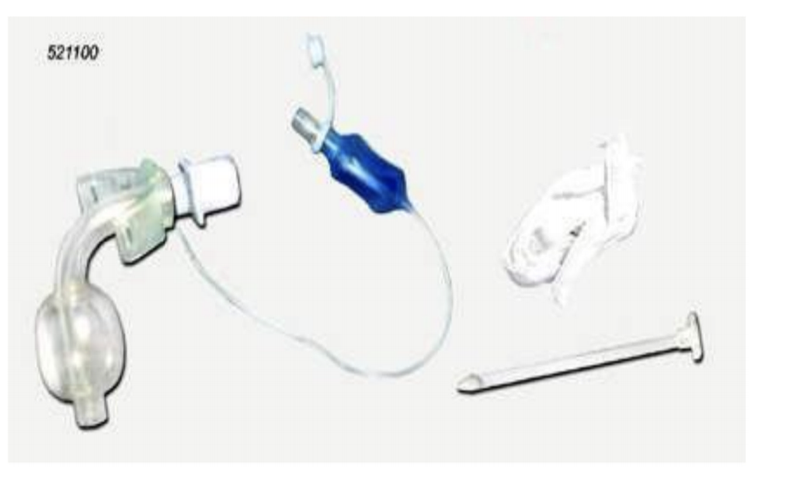

# Acute Respiratory Distress Syndrome (ARDS)
* Severe form of respiratory failure that may occur even in previously healthy individuals
* Characterized by lung edema, formation of hyaline membranes, microatelectasis, and alveolar hemorrhage causing dyspnea and hypoxia

# Etiology
* Shock of any etiology
* Infectious cause (sepsis)
* Micro emboli- fat or air embolism
* Liquid aspiration
* Inhaled toxins – smoke, toxic agents
* Metabolic disorders
* Trauma
* Eclampsia
* Oxygen toxicity
* Banked blood- large amounts
* Overhydration
* Drug overdose – particularly heroin
* Cardiopulmonary bypass

# Pathogenesis
* Diffuse damage to that alveolar-capillary membrane
* Increased permeability and leakage of fluid at the alveolar-capillary membrane
* Damage to type II pneumocytes
* Interstitial and alveolar edema results in interference with gas exchange and hypoxemia. 
* Reduced FRC, Intrapulmonary shunting and Decreased compliance
* Protein exudates destroy surfactant causing alveolar collapse
* Protein exudates from the hyaline membrane causes interstitial fibrosis
* Profound hypoxemia in spite of high-inspired oxygen fraction (FIO2)

# ~Question 2
Which statement describes acute respiratory distress syndrome (ARDS)?

[WRONG] This condition develops because the exocrine glands start to work incorrectly leading to thick, copious mucous in the alveolar sacs
[WRONG] ARDS is a pulmonary disease that gradually causes chronic obstruction of airflow from the lungs
[WRONG] Acute respiratory distress syndrome occurs due to the collapsing of a lung because air has accumulated in the pleural space
[RIGHT] This condition develops because alveolar capillary membrane permeability changes and fluid collects in the alveolar sacs

# Pathophysiology

# Clinical Presentation
* Tachypnea
* Increasing dyspnea
* Hyperventilation
* Respiratory distress
* Labored respirations
* Retractions
* Cyanosis
* Restlessness, anxiety

# Diagnostics

### ABG
* Refractory hypoxemia – hallmark of disease refractory to O2 therapy (PaO2<55 mmHg)
* Hypocapnia – compensatory increase in minute ventilation to maintain PaO2 until patient fatigues
* Respiratory alkalosis secondary to hyperventialtion

### CXR
* Diffuse bilateral pulmonary infiltrates

### Pulmonary Function Tests
* PaO2<55 mmHg on FIO2 .50
* Decreased lung compliance
* Reduced functional residual capacity
* Right to left shunt
* PaO2/FIO2 ratio = PaO2/FIO2
* Normal ratio – 300 to 400
* Acute lung injury – 200 to 300
* ARDS - <200

# ~Question 16
Your patients' PaO2 / FiO2 ratio is < 200, what does this suggest?

[RIGHT] Adult Respiratory Distress Syndrome (ARDS)
[WRONG] Normal Pulmonary Function
[WRONG] Acute Lung Injury

# ~Question 4
Which finding on the chest x-ray is indicative of ARDS?

[WRONG] Infiltrates in the upper lobes
[WRONG] Enlargement of the heart with bilateral lower lobe infiltrates
[RIGHT] White-out infiltrates bilaterally 
[WRONG] Normal chest x-ray

* ARDS is a type of respiratory failure that occurs when the capillary membrane that surrounds the alveoli sac becomes damaged, which causes fluid to leak into the alveoli sac. The first answer describes cystic fibrosis, the second describes COPD, and the third describes a pneumothorax.

# ~Question 13 
Which diagnostic test is routinely used for patients with suspected respiratory failure? (Select all that apply)

[RIGHT] Chest x-ray
[RIGHT] Arterial blood gas analysis
[WRONG] Right-sided heart catheterization
[RIGHT] Electrocardiography

* Respiratory failure may be associated with a variety of clinical manifestations. However, these are nonspecific, and very significant respiratory failure may be present without dramatic signs or symptoms. This emphasizes the importance of measuring arterial blood gases in all patients who are seriously ill or in whom respiratory failure is suspected. Chest x-ray is essential. Electrocardiography should be performed to evaluate the possibility of a cardiovascular cause of respiratory failure; it also may detect dysrhythmias resulting from severe hypoxemia or acidosis. Right-sided heart catheterization is controversial and would only be used in cases where cardiac involvement is suspected.

# Management

### Maintaining Oxygenation
* Restoration of arterial oxygen levels
 * Lowest FIO2 to produce oxygen saturation
 * Maintain PaO2 level within acceptable range

### Mechanical Ventilation
* Set RR and TV to meet ventilation requirements
* Lower tidal volumes decreases risk of barotrauma

### Use of PEEP
* Improves oxygenation by re-expanding alveoli
* Decreases shunting by opening non-ventilatory lung units
* Use lowest level of PEEP
* High PEEP may decrease cardiac output and increase barotrauma

### Endotrachael tubes

### Tracheostomy tube

### Cardiovascular Support
* Fluid management
* Inotropic/vasoactive support
* Normalize Hgb
* Appropriate use of hemodynamic monitoring
* Sedation/paralysis/pain management
* Narcotic – pain management
* Benzodiazepines – sedation, amnesia and muscle relaxants
* Neuromuscular blocking agents (paralytic agents)

### Pharmacological Support
* Antibiotics
* Antipyretics – avoid cooling blankets which may cause shivering

### Nutritional Support

# Question 1
A patient being treated for aspiration pneumonia receiving oxygen via a 100% non-rebreather mask. Which finding is a hallmark sign that the patient is developing acute respiratory distress syndrome (ARDS)?

[WRONG] The patient is experiencing bradypnea.
[WRONG] The patient is tired and confused.
[RIGHT] The patient's PaO2 remains at 45 mmHg. 
[WRONG] The patient's blood pressure is 180/96.

* A hallmark sign and symptom found in ARDS is refractory hypoxemia. Although the patient is receiving a high amount of oxygen (using a 100% non-rebreather mask), the patient is STILL hypoxic given that their arterial oxygen level is remaining at 45 mmHg (a normal is 80 mmHg but when treating patients with ARDS, the goal is at least 60 mmHg).

# Question 3
Which change in acute respiratory distress syndrome (ARDS) is caused by damage to the lung cells that produce surfactant?

[WRONG] Bronchoconstriction
[RIGHT] Atelectasis 
[WRONG] Upper airway blockage
[WRONG] Pulmonary edema

* Surfactant decreases surface tension in the lungs. Therefore, the alveolar sacs will stay stable when a person exhales (hence the sac won’t collapse). With the decrease in surfactant production during ARDS, alveolar sacs can easily collapse, causing atelectasis.

# Question 5
Which ABG results are expected during the early exudative phase of ARDS?

[RIGHT] PaO2 40, pH 7.59, PaCO2 30, HCO3 23 
[WRONG] PaO2 85, pH 7.42, PaCO2 37, HCO3 26
[WRONG] PaO2 50, pH 7.20, PaCO2 48, HCO3 29
[WRONG] PaO2 55, pH 7.26, PaCO2 58, HCO3 19

* This demonstrates hypoxemia with respiratory alkalosis. In the early stages of ARDS (exudative), the patient has tachypnea as the body’s way of trying to increase the oxygen level. This fast breathing will cause a lower PaCO2, leading to respiratory alkalosis. The patient will have a very low PaO2 level (normal PaO2 is 80 mmHg), the blood pH will become high (normal is 7.35-7.45).

# Question 6
Which patient below is at the HIGHEST risk for developing ARDS?

[WRONG] A 52-year-old male patient with pneumothorax
[WRONG] A 48-year-old male being treated for diabetic ketoacidosis
[RIGHT] A 69-year-old female with sepsis caused by a gram-negative bacterial infection
[WRONG] A 30-year-old female with cystic fibrosis

* Sepsis is the MOST common cause of ARDS because of the systemic inflammation that is experienced. This is also true if the cause of the sepsis is a gram-negative bacterium (this also makes the infection harder to treat). With sepsis, the immune cells that are present travel to the lungs and damage the alveolar capillary membrane leading to fluid leakage in the alveolar sacs.

# Question 7
Acute respiratory distress syndrome (ARDS) can be caused by direct or indirect lung injury. Select below all the INDIRECT causes of ARDS (select all that apply):

[WRONG] Drowning
[WRONG] Aspiration
[RIGHT] Sepsis 
[RIGHT] Blood transfusion 
[WRONG] Pneumonia 
[RIGHT] Pancreatitis 

* Indirect causes are processes that can cause inflammation OUTSIDE of the lungs. Drowning, aspiration, and pneumonia are issues that arise in the lungs (therefore, they are DIRECT causes of lung injury).

# Question 8
A patient is on mechanical ventilation with PEEP (positive end-expiratory pressure). Which finding indicates the patient is developing a complication requiring immediate treatment?

[WRONG] HCO3 26 mmHg
[RIGHT] Blood pressure 70/45
[WRONG] PaO2 80 mmHg
[WRONG] PaCO2 38 mmHg 

* Mechanical ventilation with PEEP increases intrathoracic pressure and decreases the cardiac output.

# Question 9
Which findings indicate that prone positioning was beneficial to a patient with ARDS (select all that apply)?

[RIGHT] Improvement in lung sounds 
[WRONG] Correction of a V/Q mismatch
[RIGHT] PaO2 increased from 59 mmHg to 82 mmHg 
[WRONG] PEEP needs to be titrated up to 15 mmHg

* Prone positioning helps improve PaO2 (82 mmHg is a sufficient level) without actually giving the patient high concentrations of oxygen. It helps improve perfusion and ventilation (hence correcting the V/Q mismatch). In this position, the heart is no longer laying against the posterior part of the lungs (improving air flow and subsequently lung sounds) and it helps move secretions from other areas that were filled with fluid and couldn’t move in the supine position, hence improving atelectasis.

# Question 10
A patient is experiencing respiratory failure with pulmonary edema.  Which pulmonary artery wedge pressure measurement indicates that this type of respiratory failure is NOT cardiac related?

[WRONG] >25 mmHg
[WRONG] <10 mmHg 
[WRONG] >50 mmHg
[RIGHT] <18 mmHg

* A pulmonary artery wedge pressure measures the left atrial pressure. A pulmonary catheter is "wedged" with a balloon in the pulmonary arterial branch to measure the pressure. If the reading is less than 18 mmHg it indicates that this is NOT a cardiac issue but most likely ARDS. 

# Question 11 
When caring for a patient on mechanical ventilation with PEEP for treatment of ARDS, why would the PEEP setting be at 10 mmHg?

[WRONG] This pressure setting assists the patient with breathing in and out and helps improve air flow
[WRONG] This pressure setting will help prevent a decrease in cardiac output and hyperinflation of the lungs
[WRONG] This pressure setting helps prevent fluid from filling the alveolar sacs
[RIGHT] This pressure setting helps open and keep open the  alveolar sacs that might otherwise collapse 

* This PEEP setting helps open the alveoli sacs that have collapsed and keep them open.

# Question 12
Which condition is a common cardiovascular complication in patients with acute respiratory failure?

[WRONG] Hypertension
[RIGHT] Endocarditis
[WRONG] Aortic Coarctation
[WRONG] Coronary artery spasm

* Common cardiovascular complications in patients with acute respiratory failure include hypotension, reduced cardiac output, arrhythmia, endocarditis, and acute myocardial infarction. These complications may be related to the underlying disease process, mechanical ventilation, or the use of pulmonary artery catheters.

# Question 14 
Which result indicates an airflow obstruction in a patient with suspected chronic respiratory failure?

[WRONG] A forced expiratory volume in 1 second (FEV1) level >1 L
[WRONG] A forced vital capacity (FVC) level >1.5 L
[RIGHT] A decrease in the FEV1-to-FVC ratio (FEV1/FVC)
[WRONG] A reduction in both FEV1 and FVC with a normal FEV1/FVC

* Normal values for FEV1 and FVC suggest a disturbance in respiratory control. A decrease in FEV1/FVC indicates airflow obstruction, whereas a reduction in both FEV1 and FVC and maintenance of FEV1/FVC suggest restrictive lung disease.
Respiratory failure is uncommon in obstructive diseases when FEV1 is >1 L and in restrictive diseases when FVC is >1 L.

# Question 15 
Which ventilator setting is recommended to avoid severe dynamic hyperinflation in patients with respiratory failure?

[RIGHT] Tidal volume of 6 mL/kg
[WRONG] Tidal volume of 8-10 mL/kg
[WRONG] Respiratory rate of 13-15 breaths/min
[WRONG] Respiratory rate >15 breaths/min

* After the initiation of mechanical ventilation, patients with status asthmaticus frequently develop severe dynamic hyperinflation, which is often associated with adverse hemodynamic effects. The development of dynamic hyperinflation can be minimized by delivering the lowest possible minute ventilation in the least possible time. Therefore, the initial ventilatory strategy should involve the delivery of relatively low tidal volumes (eg, 6 mL/kg) and lower respiratory rates (eg, 8-12 breaths/min) with a high inspiratory flow rate.
