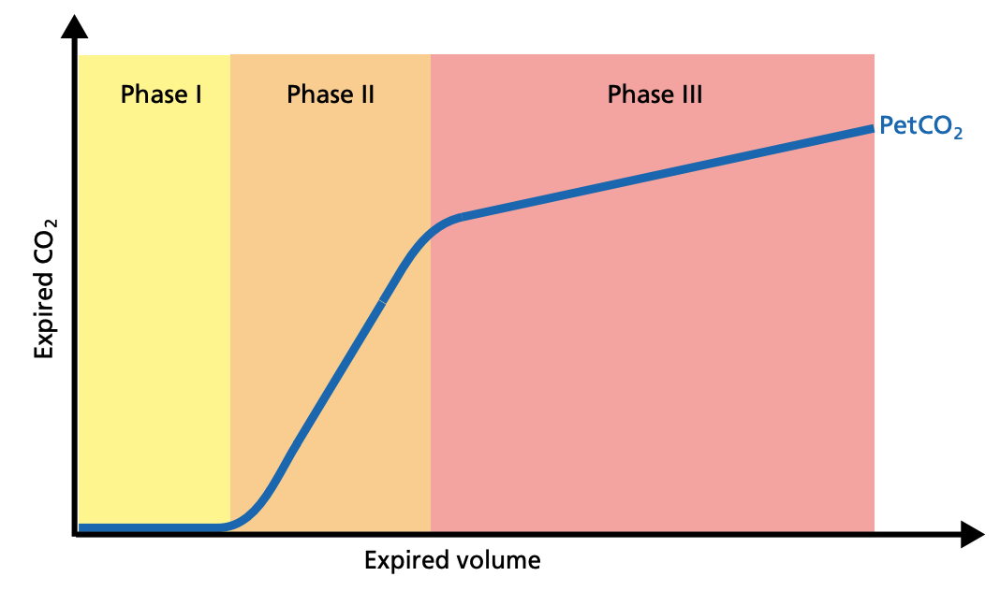
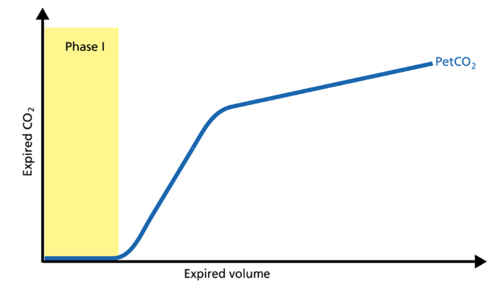
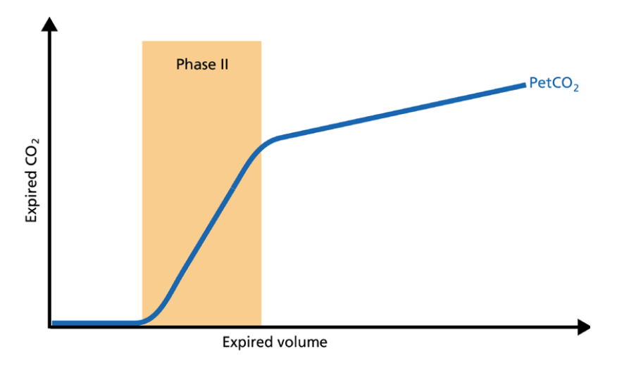
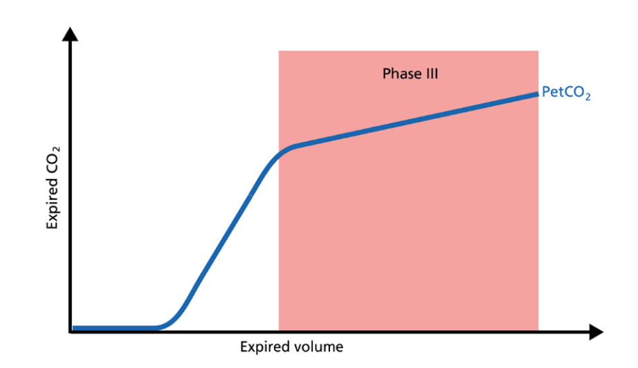
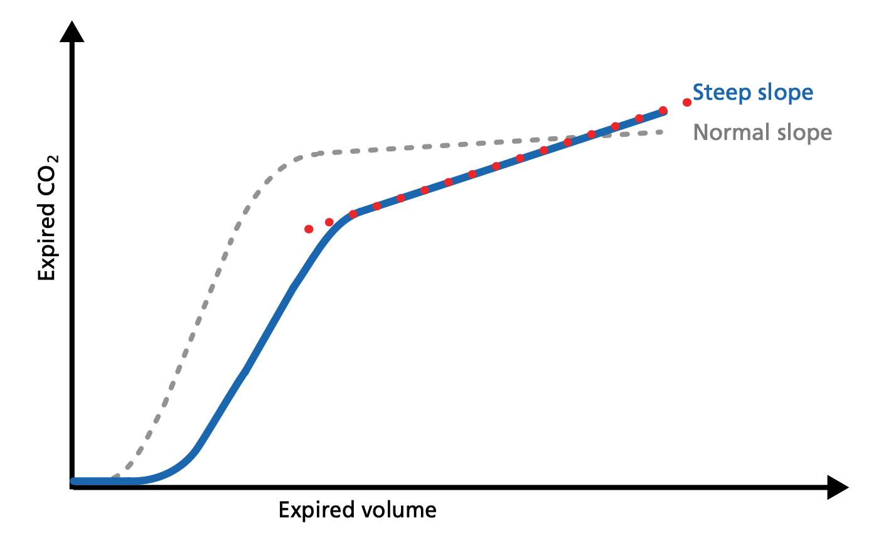

# The three phases

The alveolar concentration of carbon dioxide (CO2) is the result of metabolism, cardiac output, lung perfusion, and ventilation. Change in the concentration of CO2 reflects perturbations in any or a combination of these factors. Volumetric capnography provides continuous monitoring of CO 2 production, ventilation/perfusion (V/Q) status, and airway patency, as well as function of the ventilator breathing circuit itself.

Expired gas receives CO2 from three sequential compartments of the airways, forming three recognizable phases on the expired capnogram. A single breath curve in volumetric capnography exhibits these three characteristic phases of changing gas mixtures - they refer to the airway region in which they originate:

* Phase I - Anatomical dead space
* Phase II - Transition phase: gas from proximal lung areas and fast emptying lung areas
* Phase III - Plateau phase: gas from alveoli and slow emptying areas

Using features from each phase, physiologic measurements can be calculated.

# Phase I – Anatomical dead space

The first gas that passes the sensor at the onset of expiration comes from the airways and the breathing circuit where no gas exchange has taken place = anatomical + artificial dead space. This gas usually does not contain any CO 2. Hence the graph shows movement along the X-axis (expired volume), but no gain in CO2 on the Y-axis.

* A prolonged Phase I indicates an increase in anatomical dead space ventilation (VDaw).
* Presence of CO 2 during Phase I indicates rebreathing or that the sensor needs to be recalibrated.

# Phase II – Transition phase

Phase II represents gas that is composed partially of distal airway volume and mixed with gas from fast emptying alveoli. The curve slope represents transition velocity between distal airway and alveolar gas – providing information about perfusion changes and also about airway resistances.

* A prolonged Phase II can indicate an increase in airway resistance and/or a Ventilation/Perfusion (V/P) mismatch.

# Phase III – Plateau phase

Phase III gas is entirely from the alveoli where gas exchange takes place. This phase is representative of gas distribution. The final CO2 value in Phase III is called end-tidal CO2 (PetCO2).

* A steep slope in Phase III provides information about lung heterogeneity with some fast and some slow emptying lung areas.
* For example, obstructed airway results in insufficiently ventilated alveoli, inducing high CO2 values and increased time constants in this region.

### Slope of Phase III

The slope of Phase III is a characteristic of the volumetric capnogram shape. This slope is measured in the geometric center of the curve, which is defined as the middle two quarters lying between VDaw and the end of exhalation.

A steep slope can be seen, for example, in COPD and ARDS patients.