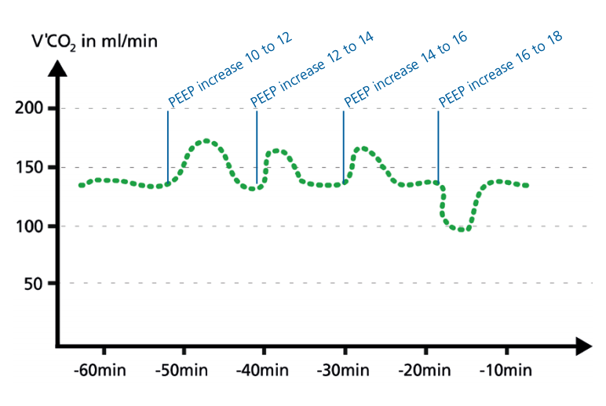

# PetCO 2 versus V‘CO2 - Opposing, asynchronous trends
If the PetCO2 trend moves up while the V‘CO2 trend decreases for a while and then returns to baseline, this indicates a worsening of ventilation.

If the PetCO2 trend moves down while the V‘CO2 trend increases for a while and then returns to baseline, this indicates an improvment of ventilation.

# PetCO2 versus V‘CO2 - Synchronous trends

Rising PetCO 2 and V‘CO2 trends indicate increasing CO 2 production (agitation, pain, fever).

Falling PetCO2 and V‘CO2 trends indicate a decrease in CO2 production.

# Optimizing PEEP by trends

When PEEP change is associated with an improving ventilation/perfusion ratio, V‘CO2 shows a transient increase for a couple of minutes and then returns back to baseline, that is, in equilibrium with CO2 production.

When PEEP change is associated with a worsening of the ventilation/perfusion ratio, V‘CO2 transiently decreases for a few minutes and then returns to baseline.

# Detecting alveolar derecruitment
Volumetric CO2 provides continuous monitoring to detect derecruitment and recruitment of alveoli.

Alveolar ventilation and V‘CO2 will first decrease if the lung derecruits, and will then stabilize again at equilibrium.

Recruitment, during, for example,a PEEP increase, can be detected by short V‘CO2 peaks before V‘CO2 returns to equilibrium.