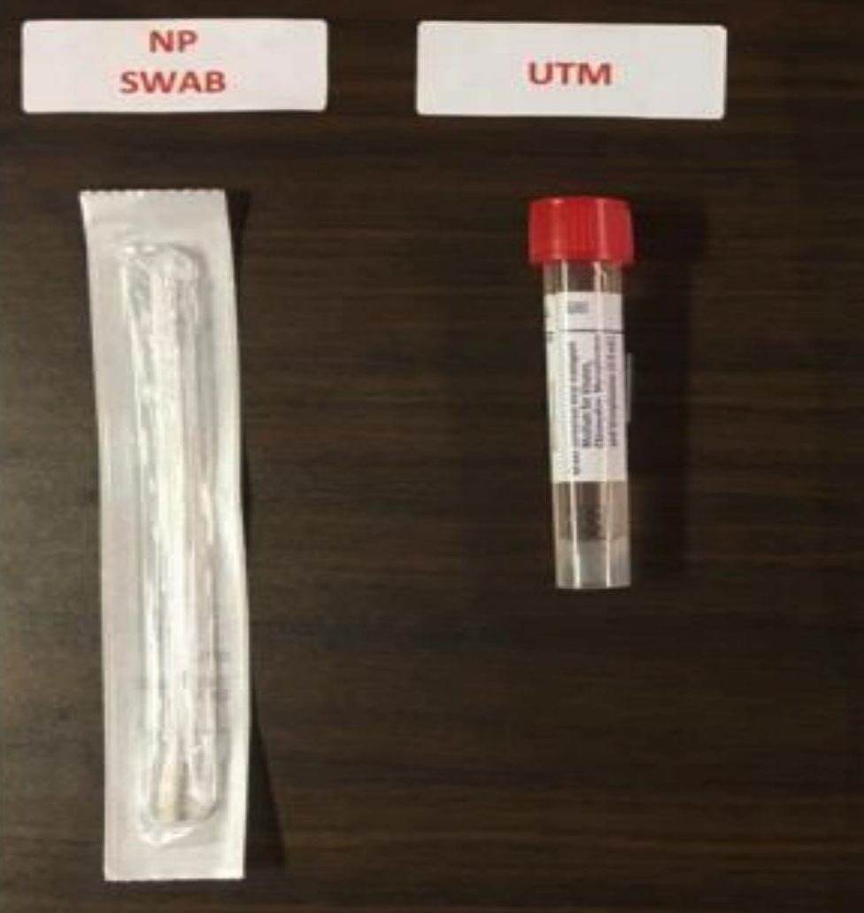
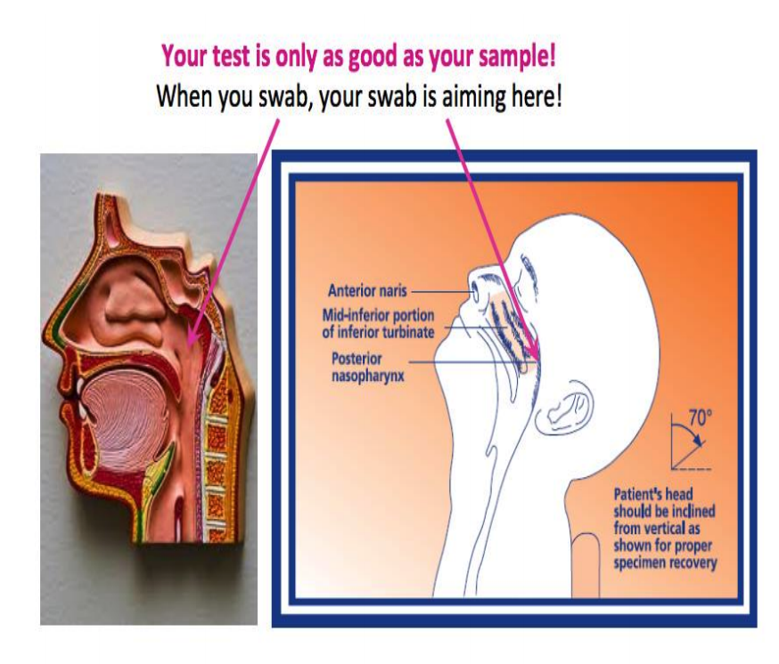

# 2019 - Coronavirus (COVID-19) Specimen Collection Kit

### Use: 
* To collect nasopharyngeal specimens for 2019-Coronavirus (SARS-CoV-2), the virus that causes COVID-19.

### Kit contents:
* 1 Tube of Universal Transport Media (UTM)
* 1 Nasopharyngeal swab (smaller swab, flexible shaft) (CDC recommended)

# Specimen Collection Types

### Nasopharyngeal specimen (CDC recommended specimen type)
Materials: 1 Flock swabs in viral transport media (i.e. Hank's® Media)

The individual collecting the specimen should wear a face mask, gown, gloves and face shield. An N95 Mask is not required.

The individual collecting the swab should wear a face mask, gown, gloves and face shield.

#### Steps for Nasopharyngeal swab (NP):

1. The distance from the patients nose to ear gives an estimate of the distance the swab should be inserted.

    * Tilt patient’s head back 70 degrees.
    * Insert one swab straight back into one nostril (swab should reach depth equal to distance from nostrils to outer opening of ear).
    * Leave in place for a few seconds.
    * Repeat on the other nostril using the same swab on both nostrils.
    * Immediately place the swab into a vial containing viral transport media (i.e. Hank’s® Media) and break off remaining shaft to close.

2. Send the swab to the laboratory (tube station 91).

3. If unable to obtain a specimen, escalate.

Another option for upper respiratory tract specimen, especially in children is NP wash/aspirate or nasal aspirate: collect 2-3mL of specimen in a sterile, leak-proof, screw-cap sputum collection cup or sterile dry container.**

# Laboratory Submission

* Once the specimen is collected, Securely tighten the cap on the tube of UTM.
* Label the UTM specimen according to hospital policy with the appropriate laboratory label.
* Insert tube into specimen transport bag and close bag tightly.
* Submit the specimen to the laboratory.